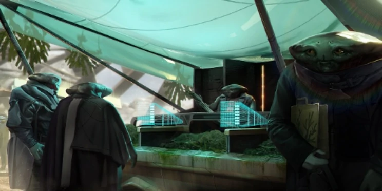

# Amblyr

Pacifici e letargici, gli Amblyr detestano la violenza e adorano la maggior parte dei tipi di alghe.

Gli Amblyr sono una razza tranquilla che deve ancora lasciare il suo segno nella galassia.
Poco conosciuti, nonostante l'infamia del loro cittadino più famoso: un terrorista di nome Amplum. Sembrano discendere da una specie rettile marina. Il pianeta natale degli Amblyr è un pianeta umido e paludoso in cui le città più sofisticate della società sono enormi piattaforme di alghe che si spostano attraverso le distese fangose.

Con abbondanti raccolti di alghe che forniscono la maggior parte della loro dieta e riserve di biocarburante, la civiltà Amblyr è noiosamente armoniosa incentrata sul progresso e la prosperità di tutti.

