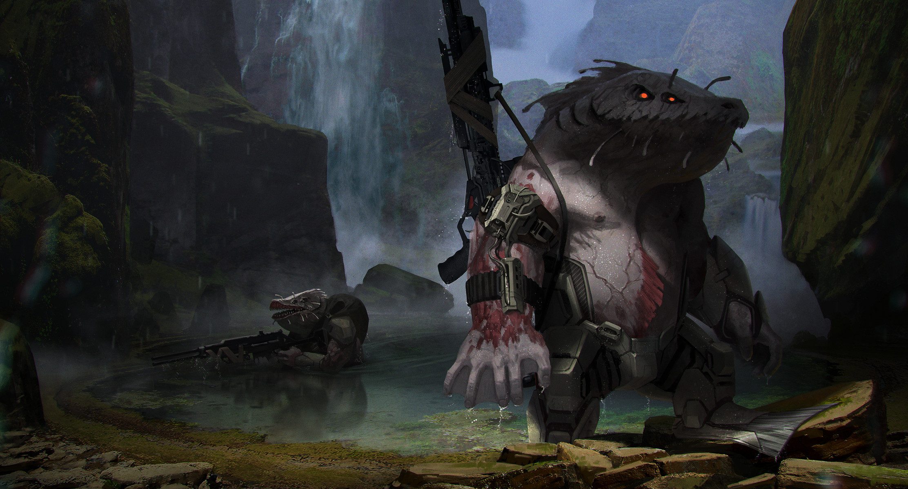

# Gnashast

Profondamente territoriali, gli Gnashast difendono le loro terre con grande determinazione e grande violenza.

Specie relativamente giovane sulle isole del suo pianeta natale, gli Gnashast sono i discendenti di creature marine che strisciarono sulla terraferma alcune centinaia di migliaia di anni fa. Con la fauna del pianeta in grande difficoltà nel sopravvivere quando il livello del mare si alzava (diminuendo drasticamente la quantità di terra abitabile), gli Gnashast divennero rapidamente il principale predatore del pianeta. Con l'avvento dell'era spaziale, arrivata grazie all'intervento di un gruppo di Sophons, sono rimasti molto aggressivi come quando hanno fatto le loro prime incursioni sulla terraferma.

Gli Gnashast sono ottimi predatori, hanno un ottimo olfatto e un'eccellente vista, inoltre la loro forza e tempra è tra le più rinomate dell'intero universo. Nonostante siano molto grezzi e pochi di loro siano in grado di utilizzare anche le tecnologie più semplici, vantano un'adattabilità straordinariai che gli permettere di sopravvivere serenamente anche in ambienti sconosciuti.

Non è una razza molto accogliente, tuttavia gli Gnashast possono diventare potenti alleati se gestiti con attenzione.

