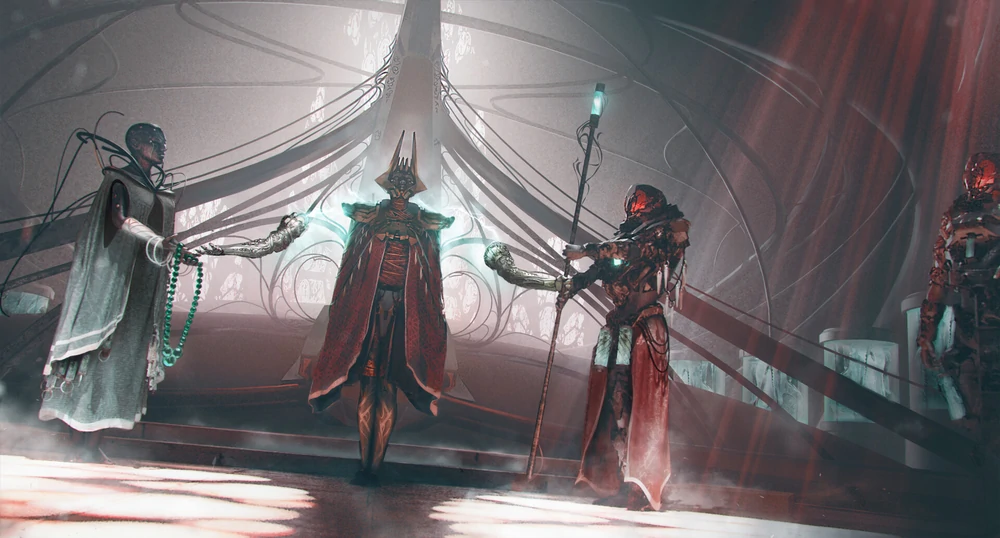
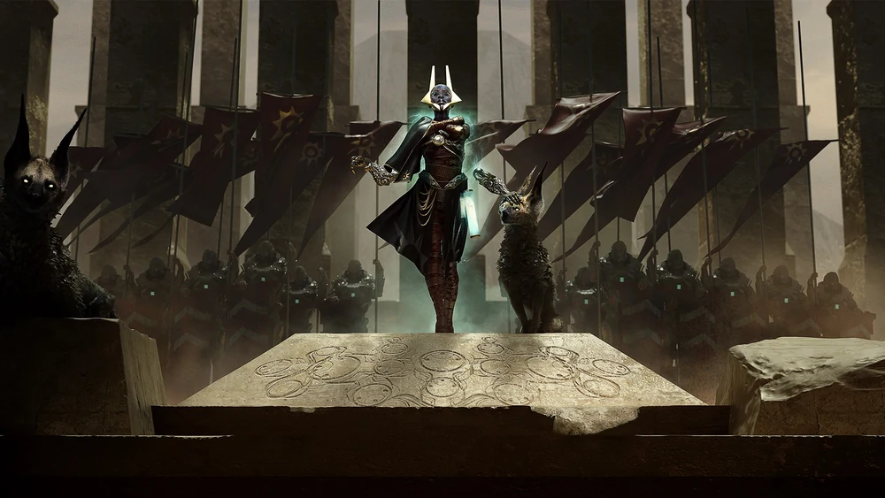
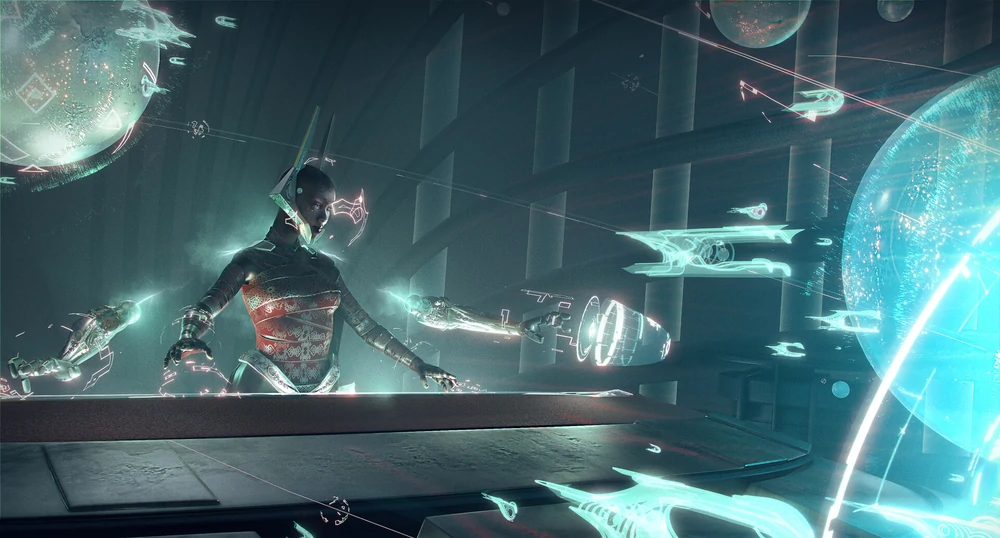
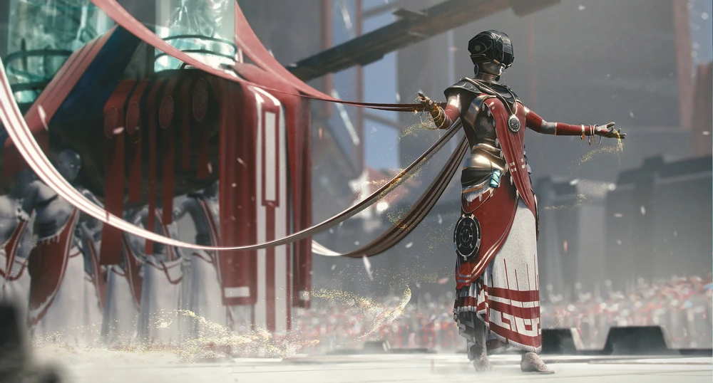
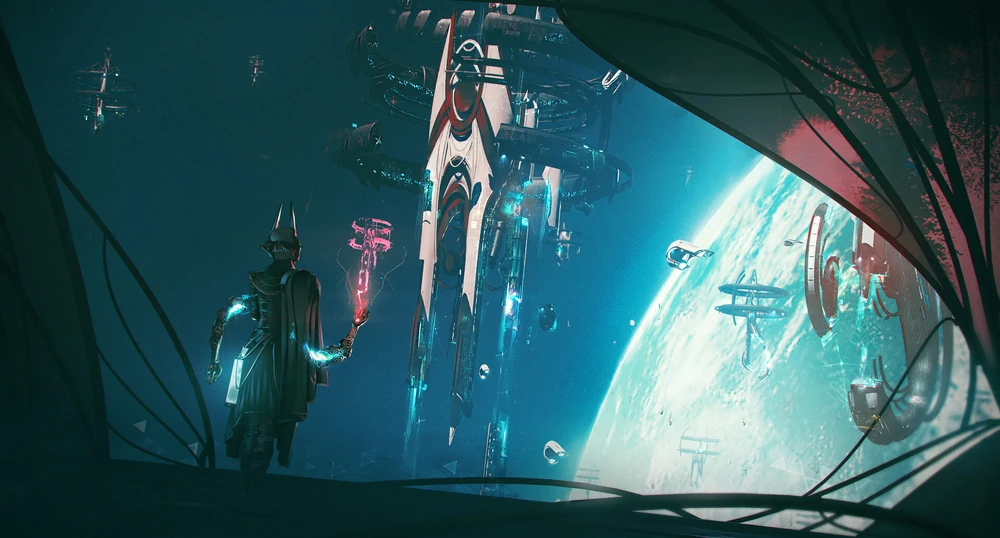

# Nakalim

I Nakalim sono una specie venerata per molti secoli come dei, dotati di innate capacità magiche sono maestri nell'arte della telecinesi.

Nonostante siano nati su di un pianeta quasi del tutto desertico, Surth, sono riusciti a prosperare senza difficoltà: il loro corpo è molto esile e ha bisogno di pochissimo cibo per sopravvivere. I Nakalim hanno sviluppato a livelli incredibili le capacità del loro cervello ottenendo una telepatia e una telecinesi fuori da ogni scala vivente.
Queste abilità innate sono usate per ogni attività, anche le più banali pertanto i loro corpi sono quasi del tutto atrofizzati e sono privi di corde vocali. È uso avvolgere braccia e gambe intorno al proprio torso con bendaggi per permettergli di rimanere composti senza controindicazioni alla loro salute precaria.

Nonostante il corpo fragile i Nakalim sono guerrieri temibili, indossano armature pesanti e possenti armi utilizzandole con il solo pensiero. Per interagire con le altre razze usano spesso delle braccia finte in *acciaio di Surth* che fanno muovere attorno a loro con la telecinesi.

