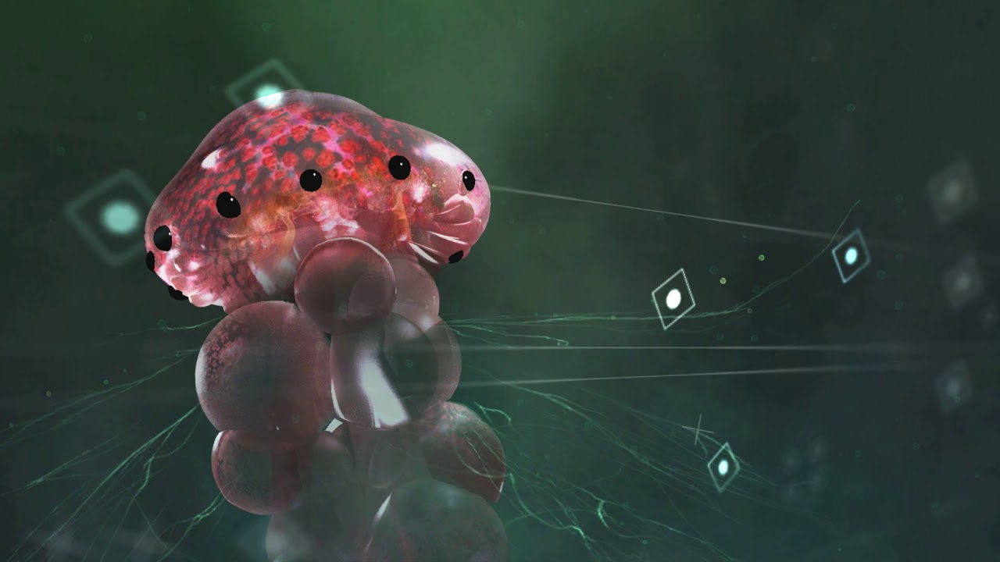
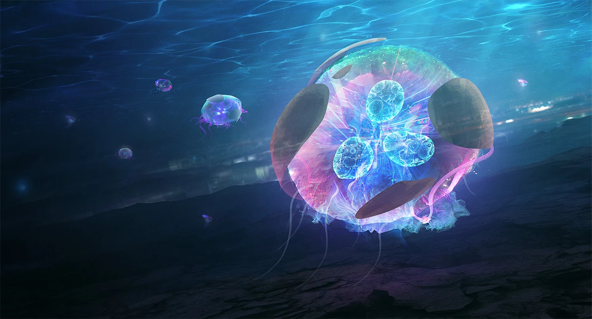
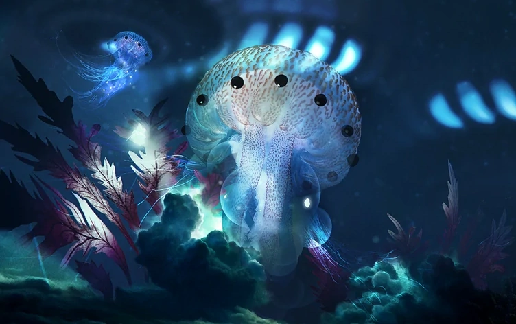
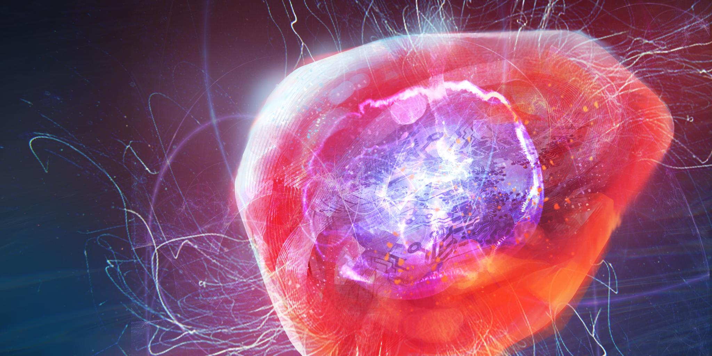

# Sefaloros

Abili mercanti, importanti studiosi e massimi esperti di metalli di ogni genere.

I Sefaloros sono forme di vita protoplasmatiche, strettamente legati alla Polvere Metallica presente sul loro pianeta di origine Banatuth. Man mano che si svilupparono, iniziarono a nutrirsi dei metalli presenti sul pianeta e col tempo impararo a digeririlo e riplasmarlo a loro discrezione. Di conseguenza diventarono formidabili costruttori e meccanici, e gran parte dei loro veicoli o delle loro infrastrutture sono filate o tessute direttamente all'interno dei loro corpi fisici.

Inoltre sono benedetti dalla capacità di staccare la loro coscienza dalla loro forma fisica.
Queste creature hanno sviluppato una forte mentalità ecologica, sempre alla ricerca dell'armonia e dell'equilibrio. Il loro obiettivo è viaggiare, incontrarsi e imparare. La loro forma naturale è relativamente indifesa ma possono trasmettere scariche di energia elettrica attraverso la loro forma fisica e sono in grado di irrigidirsi fino a diventare un blocco rigido di metallo. Inoltre sono in grado di muoversi anche nello spazio siderale senza problemi anche se non vantando una particolare velocità.

Tendenzialmente sono pacifici con chiunque ma anche se non hanno particolari strategie belliche, un solo Sefaloros può smantellare un'intera corazzata da guerra Mezari senza grande fatica (e il giusto tempo).

