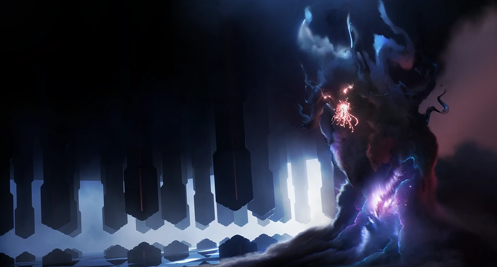

# Umbral

Una delle razze parassita più pericolose dell'universo scoperto, gli Umbral sono in perenne ricerca di creature viventi da consumare per estendere la loro esistenza.

Inizialmente un'unica antica creatura immateriale proveniente dalle profondità dello spazio intergalattico, Umbral, il padre,  vagava nel vuoto cosmico terribilmente solo, fino a quando l'esplosione di una stella lo spezzo in un infinità di frammenti.

Le creature appena nate iniziarono a scomparire nell'arco di pochi istanti e la razza degli Umbral rischiò l'estinzione poco dopo la sua nascita. Alcuni riuscirono a salvarsi nascondendosi all'interno di altre creature su di un pianete poco distante dalla loro genesi: fintanto che rimanevano in una creatura vivente potevano sopravvivere estendendo la propria vita a discapito di quella dell'ospitante che invece si consumava di un ciclo della sua esistenza ogni click.

Gli Umbral tentano da allora di trovare un corpo abbastanza duraturo da poterli ospitare all'infinito e tutti quanti.
Credono che riunendosi tutti in un unico corpo potranno tornare ad essere uno.

Un Umbral può crescere vivendo molte vite e passando da un corpo ad un'altro, possono connettersi con qualsiasi forma di vita: un lumeris, un vorian, una pianta, un astronave, un pianeta o una stella purchè generi energia che possano consumare.
Benchè siano spinti dal primario bisogno di sopravvivere sono creature molto intelligienti e usano le loro doti manipolatrici per portare all'estinzione intere razze al fine di nutrirsene.

il loro corpo è immateriale e sembra che nulla possa scalfirlo o indebolirlo, ma il tempo lo porta a degenerare molto rapidamente consumandolo fino a lasciare solo una piccola sfera nera detta Umbrite. Le dimensioni di questa pietra sono differenti in base alle dimensioni dell'Umbral che l'ha generata.

