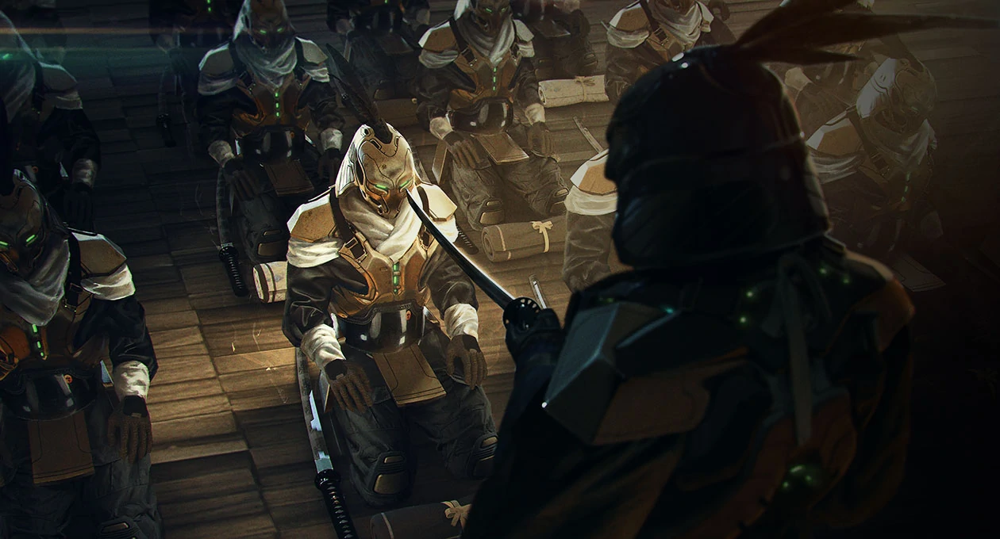
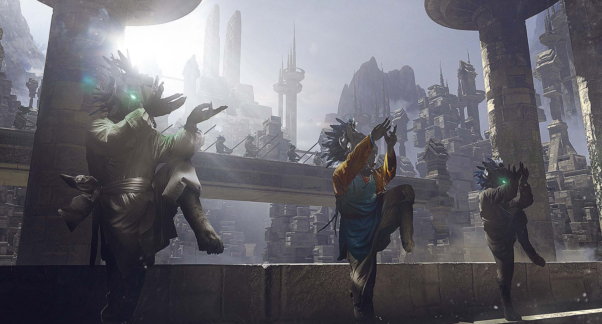
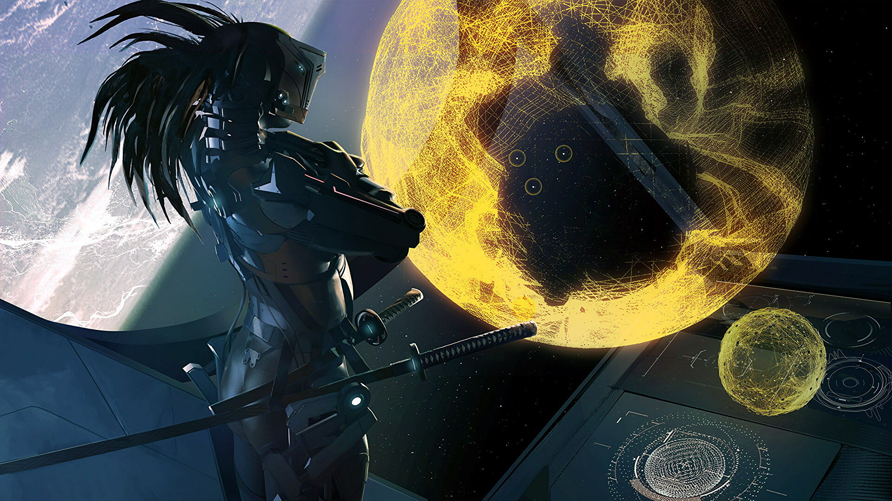
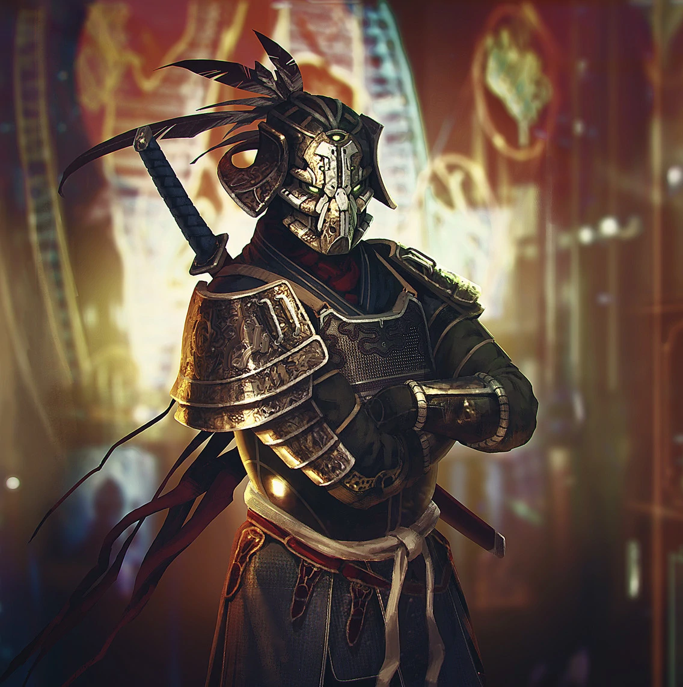
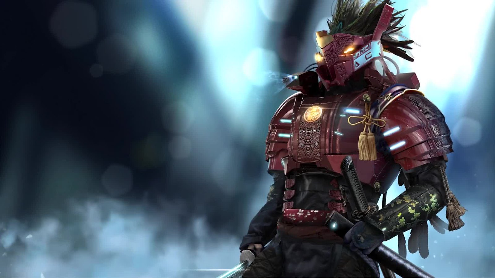

# Yuusho

Aggressivi e marziali, gli Yuusho sono noti per la loro volontà di difendere il loro onore e i loro ideali.

Un tempo parte della stessa linea di sangue degli **Hissho**, gli Yuusho furono separati dai loro parenti durante la scissione del pianeta Uchi. Mentre gli Hissho continuavano a evolvere e svilupparsi, i piccoli e isolati enclavi di Yuusho continuarono i riti e le tradizioni che avevano appreso combattendo nelle loro arene.

Vivendo su frammenti di pianeta con gravità molto alte, questa specie ha ottenuto una forza, velocità e resistenza fuori dal comune. Furono scoperti relativamente tardi nel loro processo evolutivo e furono trasformati in simil gladiatori dai Lumeris. 

Nel corso dei secoli la loro cultura e società si è evoluta esclusivamente attorno alle arti marziali, all'onore e alla guerra; di conseguenza la loro storia è fatta di spargimenti di sangue, conquiste e vendette. Sebbene ciò abbia creato un popolo molto resistente, aggressivo e pericoloso, ha anche limitato il loro avanzamento tecnologico e soprattutto il loro numero.

