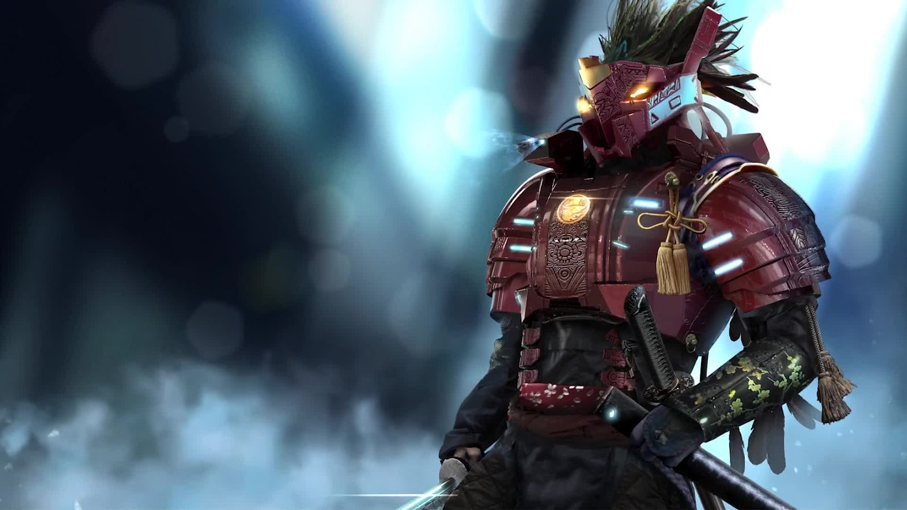

# Z'vali

Tecnicamente avanzatissimi, gli Z'Vali sono una specie autosufficiente che crede ciecamente nel potere della tecnologia.

Gli Z'vali hanno un tragico passato strettamente legato alla tecnologia. Una razza bipede intelligente nata in un mondo accogliente e ricco di risorse, gli Z'vali hanno sviluppato sistemi informatici avanzati molto prima di scoprire una tecnica di  volo spaziale.

Software e simulazioni sempre più complessi hanno permesso ai singoli Z'vali di soddisfare ogni loro esigenza attraverso realtà generate al computer, fino a far ristagnare la loro economia e portare il loro intero mondo sull'orlo della rovina. Solo le azioni di pochi innovatori spinsero la civiltà Z'vali finalmente nello spazio, lontano dal loro pianeta morente. Ora viaggiano per la galassia in comunità nomadi tendenzialmente unite.

Ma c'è chi si chiede se gli Z'vali di oggi pensino ancora di vivere in una simulazione lunga e dettagliata.

