# Cravers
Evolutisi da una forma di vita insettoide, i Cravers sono dei perfetti cacciatori/raccoglitori che non avrebbero mai sviluppato autonomamente i sistemi e le infrastrutture necessarie per la propria sopravvivenza.
Ma il caso ha voluto che su di un pianeta dove l'inquinamento e le radiazione avevano portato tutte le presenti speci all'estinzione, sono nati i Cravers.

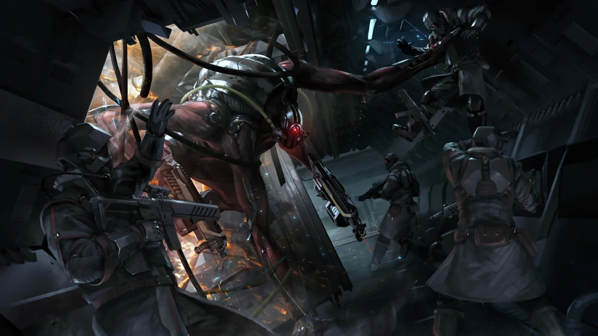

Il loro ciclo vitale è basato sul continuo consumo e per questo sono in grado di digerire qualsiasi forma di materia vegetale o animale. Poiché il loro mondo di origine è prossimo a essere consumato, sono alla ricerca di ulteriori fonti di nutrimento.

Se non continuassero a espandersi, scoprire e sfruttare nuovi mondi, la loro società finirebbe in breve tempo. Nutrire l'alveare è il loro scopo; le nozioni di "trattato", "commercio" e "pace" non esistono.

## La Regina
Sebbene la Regina sia il membro più importante della gerarchia Craver, non è necessariamente il suo leader, poiché il suo tempo è dedicato alla produzione delle generazioni future.

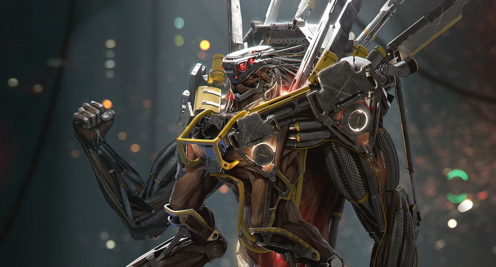

Sebbene abbia un diritto insindacabile al veto e venga consultata in caso di estremo rischio per l'alveare o di una situazione di stallo, la sua importanza è più sociale che politica.

I veri leader della società Craver sono una casta nota come Vescovi; questa piccola percentuale di Cravers, intellettualmente avanzati costituisce la spina dorsale della società ed è responsabile delle decisioni su costruzioni, guerra, sviluppo, riproduzione ed esplorazione.

## Husk
È difficile definire un pianeta natale per i Cravers, poiché erano una specie creata artificialmente e miracolosamente evoluta. Gran parte della ricerca è stata condotta sul mondo virtuale Bejek, ma dal momento che erano modelli di DNA condivisi attraverso la federazione virtuale e coltivati ​​in numerose località, è difficile determinare un singolo sito di origine. Forse la migliore definizione di un mondo natale sarebbe la fabbrica planetaria di Kovanyuv, Husk, dove furono creati molti di loro.

## Strategia dell'Alveare
La regina potrebbe essere vista come il leader della società, ma solo per il suo diritto di rifiutare i piani proposti dai vescovi.

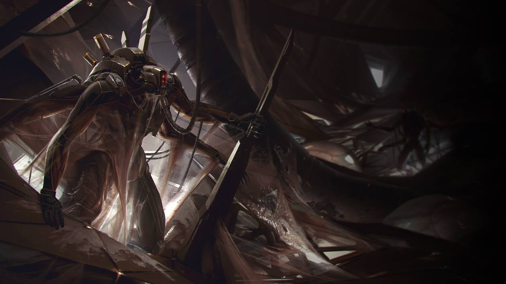

Manca però un ruolo creativo o direttivo nello sviluppo di quei piani: lei semplicemente li giudica. In effetti è difficile applicare il concetto di sistema politico ai Cravers, poiché ben due terzi della loro popolazione hanno a malapena un senso di individualità sufficiente a comprendere l'idea di un voto.

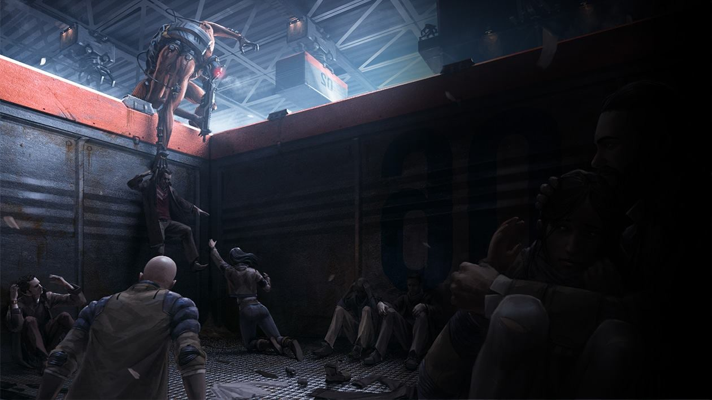
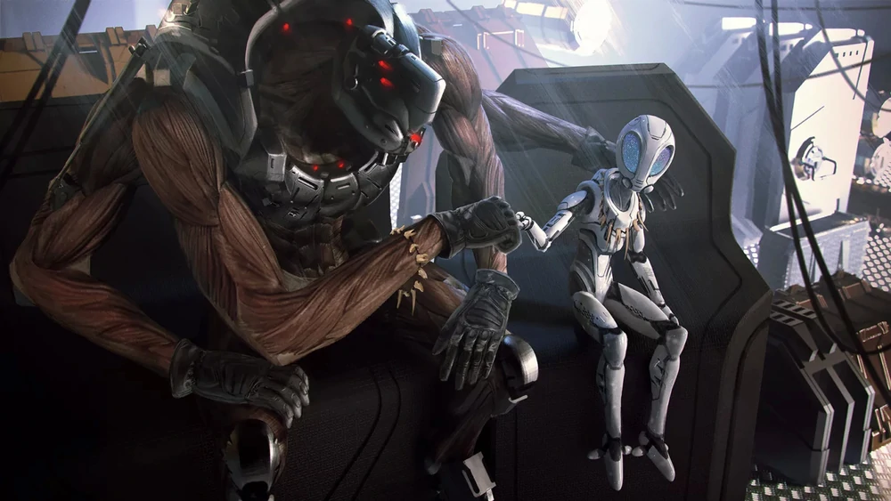
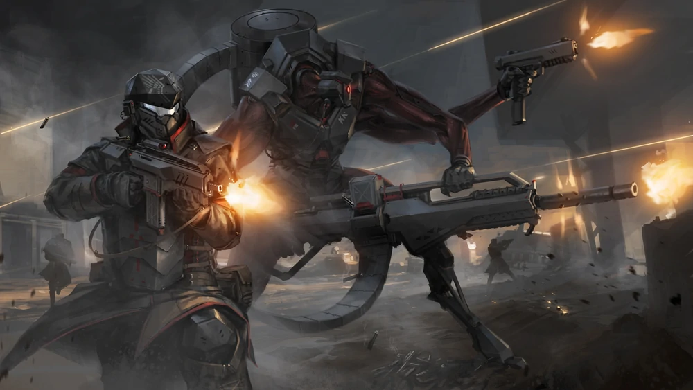
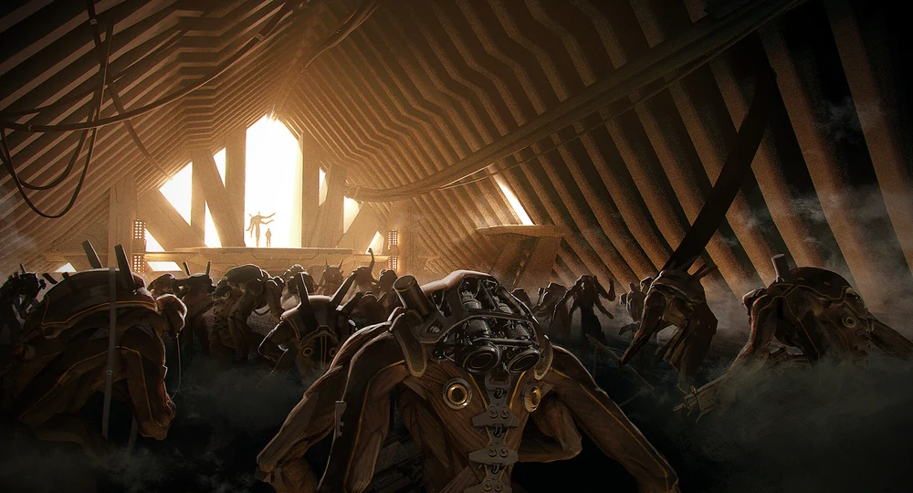
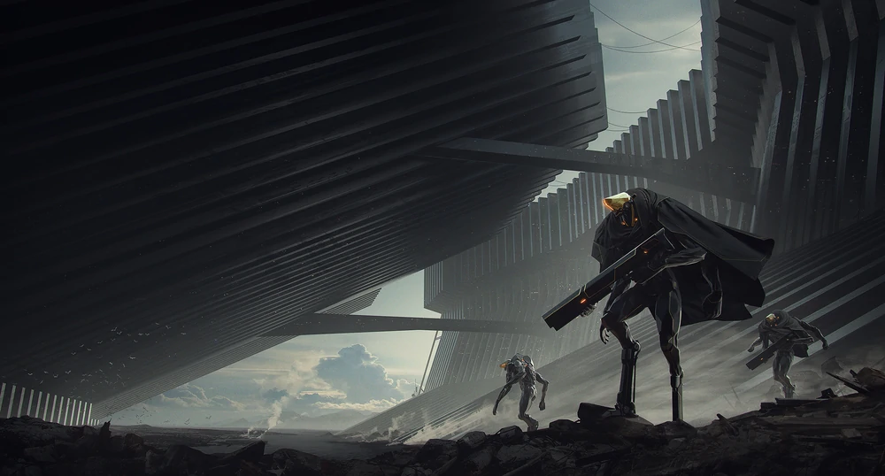

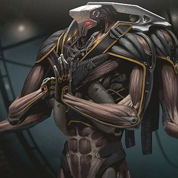 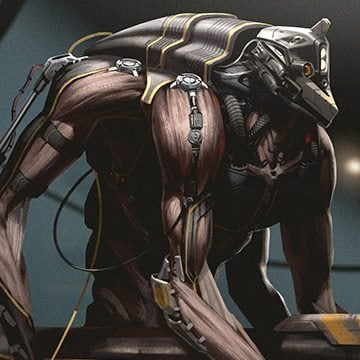 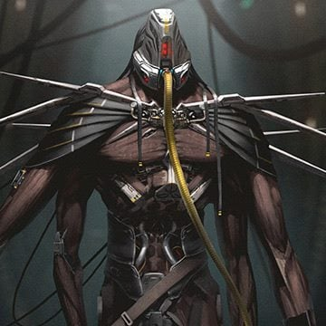 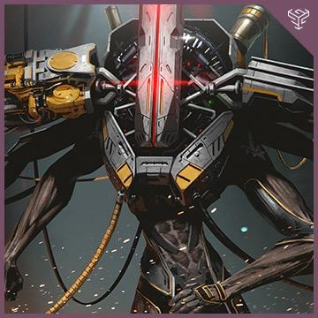

## In gioco

##### Modificatori alle Caratteristiche

**+4 For, +4Cos, -2 Int, -4 Car**

Tutti i Cravers fanno parte di una complessa rete di menti che permette a tutta questa razza di comunicare tra loro, questo ha empedito loro di creare forti personalità indipendenti e soprattutto incapaci di relazionarsi, visto che sono stati costretti a farlo esclusivamente con le creature aliene della propria razza. I loro corpi sono però robusti e massicci, più forti della maggior parte delle razze incontrate fino ad ora.

##### Tratti Razziali

- **Punti Ferita**: 10
- **Taglia e Tipo**: i Cravers sono Umanoidi Grandi.
- **Scurovisione**: i Cravers vedono al buio fino a 18 metri.
- **Quattro braccia**: i Cravers vantano un paio di baccia secondarie meno robuste che possono utilizzare come una mano nel manipolare oggetti, cosa che permette loro di impugnare e tenere armi e oggetti come se avessero 4 mani. Ciò non aumenta il numero di attacchi che possono effettuare in combattimento ma quando impugnano più armi possono alternare gli attacchi di più armi agilmente. Possono essere invece usati per impugnare un'arma da mischia con più efficacia aumentando il bonus di For a x3.
- **Intimidazione**: i Cravers hanno Bonus Razziale +2 alle prove di Intimidire grazie alla loro natura spaventosa.
- **Pelle d'Acciaio**: alcuni Cravers hanno una pelle coriacea dovuta ad anni di dure condizioni, all'addestramento intenso o ad alterazioni corporee. Hanno RD 1/- che, al 10° Livello del Personaggio, sale a RD 2/-. Questa RD é cumulativa con altre forme di RD.
- **Difesa della Rete**: i Cravers danno grande valore all'amicizia e sono continuamente in guardia per proteggere i compagni. Una volta al giorno (+1 per modificatore di Int), come Reazione, quando un alleato entro 3 metri da un Cravers con questo tratto effettua un TS, il Cravers può permettere a quell'alleato di tirare due volte per il TS e tenere il risultato più alto.
- **Irrobustito**: I Cravers nascono su di un pianeta ostile e nel corso delle generazioni, hanno sviluppato un'immunità a queste condizioni. I Cravers hanno Bonus Razziale +2 ai TS sulla Tempra contro i pericoli ambientali e sono immuni alle Radiazioni.
- **Aspetto peculiare**: per i Cravers risulta quasi impossibile cammuffarsi nell'aspetto come una qualsiasi altra razza conosciuta visto il suo aspetto così peculiare. Prendono -20 alle prove di cammuffarsi in un'altra razza.

##### Tratti Razziali Variabili

- **Ferocia innata**: quando un Cravers è ridotto a 0 Punti Ferita ma non è Morto, può continuare a combattere finchè ha energia in corpo. Quando il Cravers scende a 0 PF ed è Morente (si seguono le normali regole per i personaggi morti e morenti) può continuare ad agire normalmente per un numero di round pari al proprio livello, poi perde i sensi come di consueto. Se subisce ulteriori danni prima di questo termine, non può più agire e diventa Privo di Sensi.
Sostituisce *Pelle d'Acciaio*.
- **Mente della Rete**: alcuni Cravers hanno una connessione più forte con la Rete e possono attengerci per ottenere informazioni. Questi Cravers, una volta al giorno (+1 per modificatore di Int), ottengono un bonus di +8 ad un specifico tiro basato su inteligenza.
Sostituisce *Difesa della Rete*.