# Horatios
Un trillionario straordinariamente ricco ed estremamente eccentrico stanco di tutto, lasciò l'impero Mezari in un viaggio solitario. Attraversando la galassia in animazione sospesa, Horatio fu risvegliato arrivò a un pianeta abitabile, di cui si dichiarò immediatamente Imperatore.

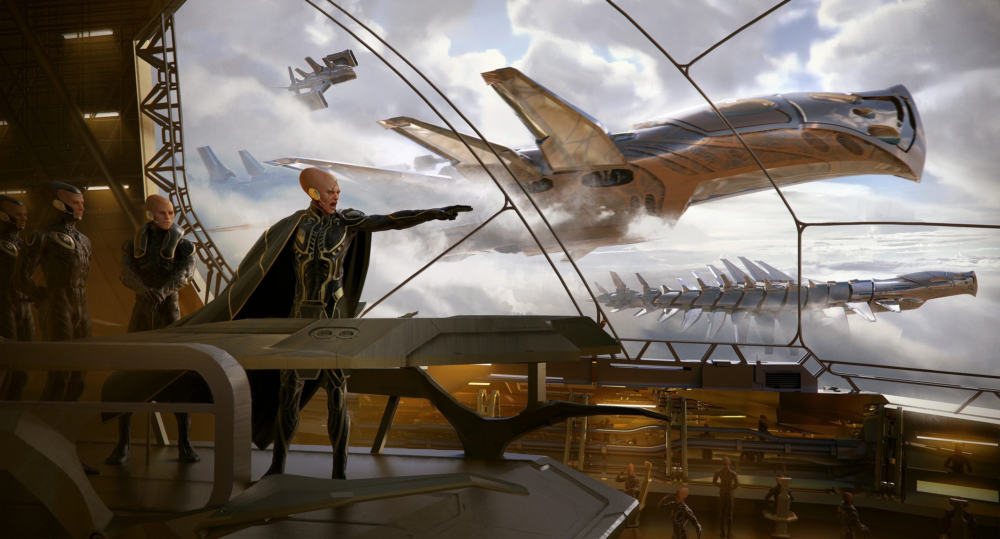

## La solitudine di Horatio
Horatio usò le informazioni raccolte dalle rovine del nuovo pianeta e le sue due lune per ottenere un'estensione innaturale della propria vita. L'esplorazione all'interno del sistema lo portò ad altre enormi scoperte e alla fine, attraverso medicine avanzate e adattamento biologico, ha evoluto il proprio corpo nel tentativo di raggiungere la perfezione fisica.

Durante questa ricerca Horatio, clonò diverse volte sè stesso per avere qualche collaboratore. Ma ora il pienata è abitato da una popolazione di soli cloni.

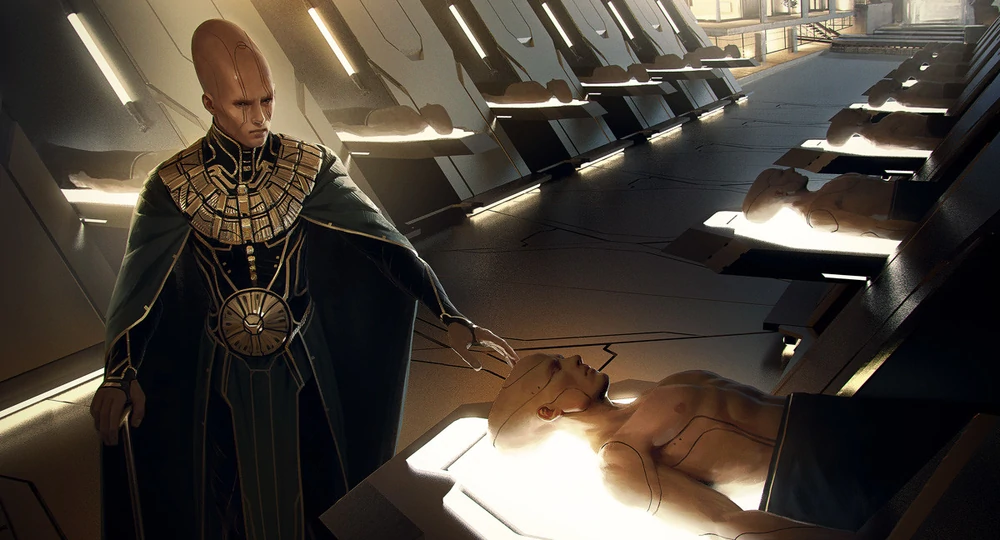

## Clonazione
Il problema per Horatio è la creazione di altri Horatios: brillanti e belli come l'originale, ma disposti a seguire gli ordini. Tutti credono che questi cloni siano copie perfette di lui, e di conseguenza che fossero altrettanto pericolosi e megalomani quanto l'originale. Di conseguenza, nonostante sia Horatio il principale pianificatore del suo vasto impero, alcune decisioni vengono prese in autonomia anche dai suoi cloni se ci sono particolari pressioni di tempo e denaro. Queste decisioni, e gli Horatio che le fanno, rischiano sempre nel prendersi tali libertà: se non fossero gradite dal Primo, rischiano infatti di essere cancellati perchè considerate troppo autonome.

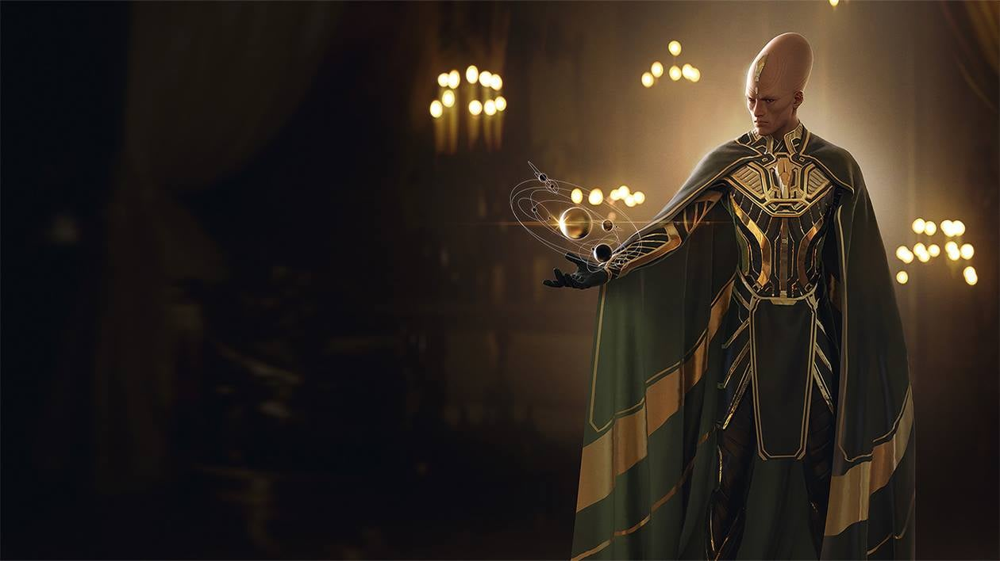

## Horatio Prime
Horatio Prime è un mondo perfetto per la vita. Asciutto, caldo, arioso e bello, è chiaro che la presenza di molte rovine indichi che più di una razza spaziale lo abbia scelto come meta preferita nel suo passato, ma ora ospita esclusivamente Horatio e le sue copie.

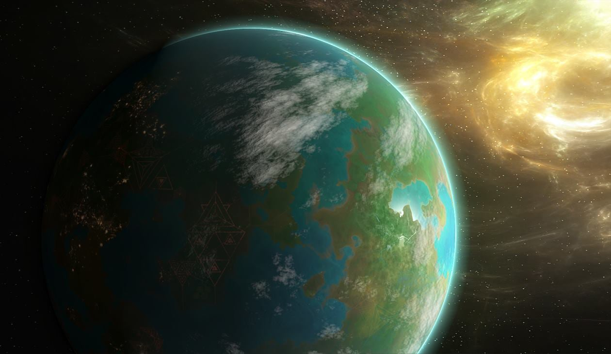

I suoi attuali progetti infrastrutturali tendono a variare con i gusti di Horatio; alcuni edifici si fondono perfettamente con il paesaggio, mentre altri sono dichiarazioni sgargianti e metalliche di stravaganza architettonica.

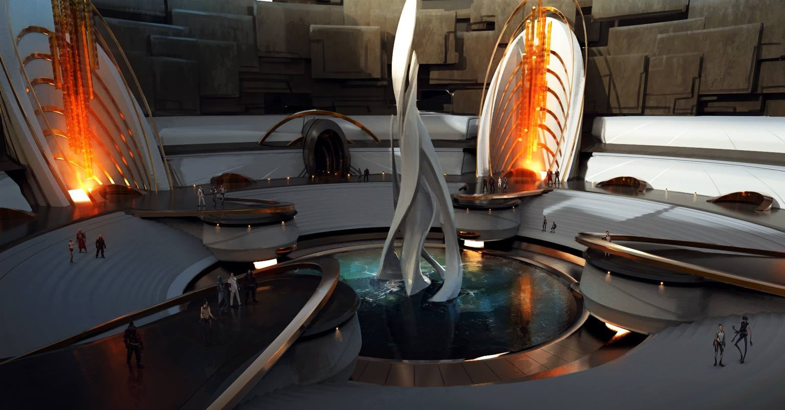

## Il Noi

"Il Noi", come ogni tanto si riferiscono a se stessi, è una società che ha una clonazione e una scienza biologica molto avanzate, ma è relativamente indietro sotto altri aspetti.

Il loro obiettivo è ricreare in tutto lo spazio la propria immagine, e per fare questo il loro bisogno primario è quello di costruire le fattorie e gli incubatori che coltivano Horatios. Poiché sono umanoidi, hanno bisogno di cibo, quindi anche lo sviluppo dell'agricoltura e delle forniture alimentari è di grande importanza.

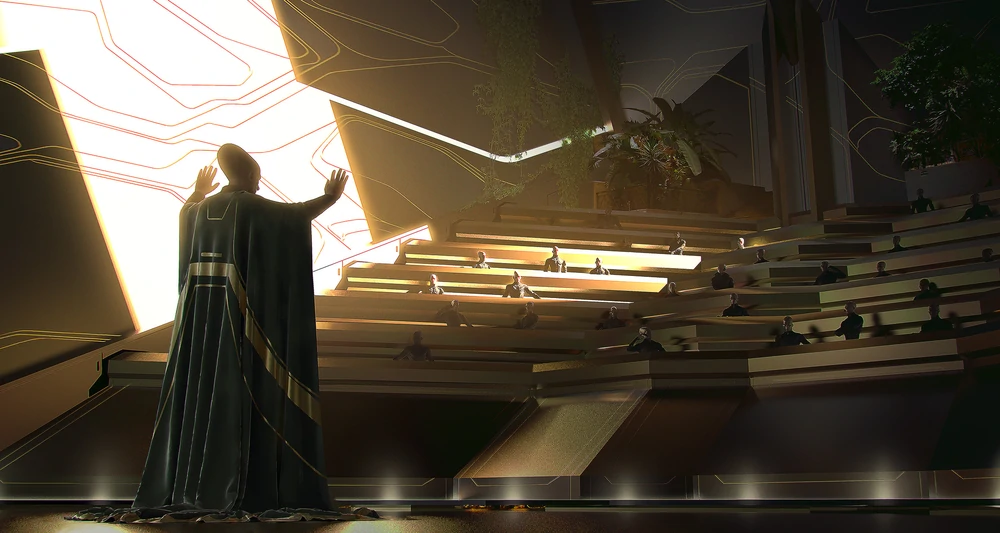

Come dice Il Primo, "Non possono esistere troppi Horatios". Tuttavia, nonostante le elevate concentrazioni di popolazione, la società rimane relativamente calma e soddisfatta; poiché gli Horatio sono stati allevati con cura, per essere leali e obbedienti, non hanno la spinta per cercare il cambiamento, specialmente i cambiamenti violenti. Naturalmente la necessità di sopravvivere li ha spinti a creare armi e navi più avanzate, ma la loro preferenza è cercare, colonizzare e far crescere i pianeti nella speranza di ricoprire l'intero universo con con la loro specie.

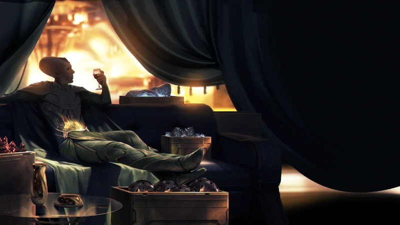
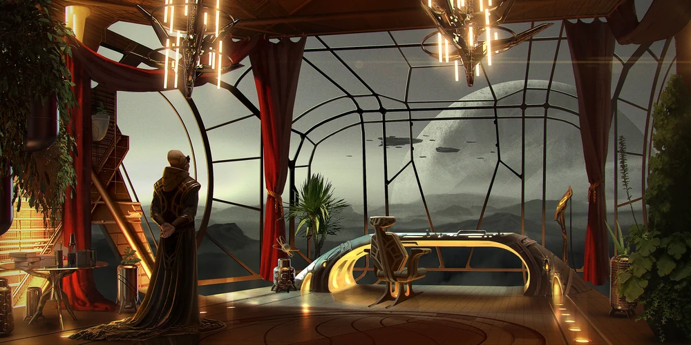
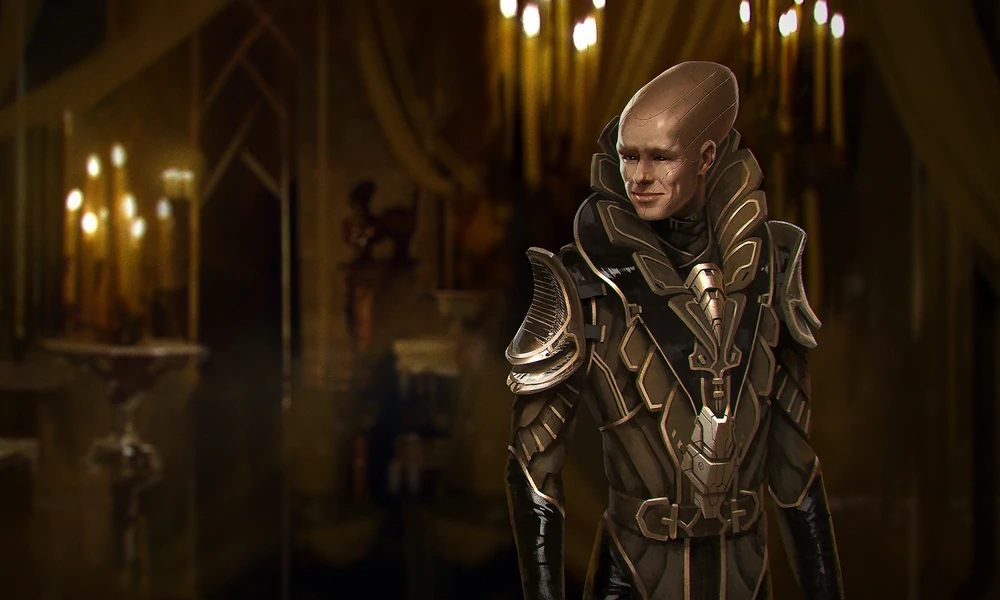
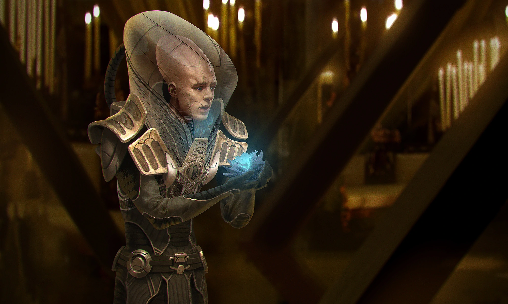
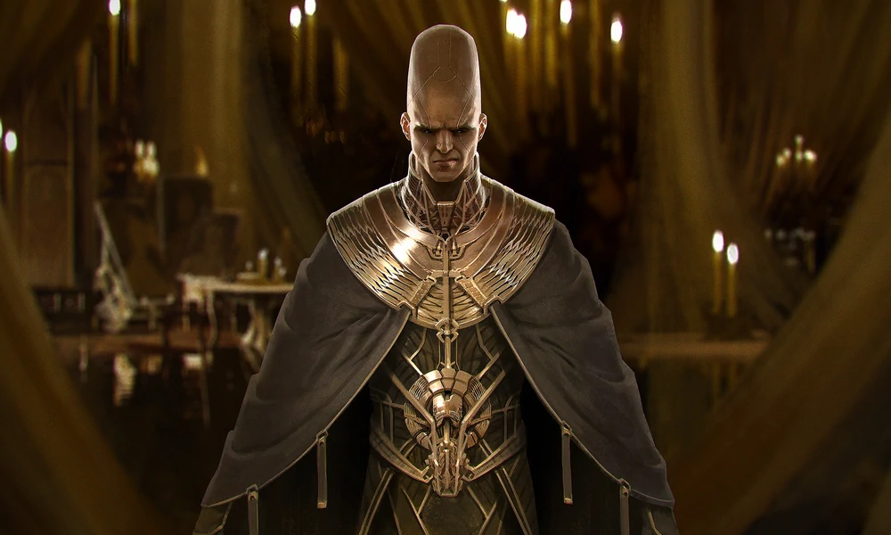
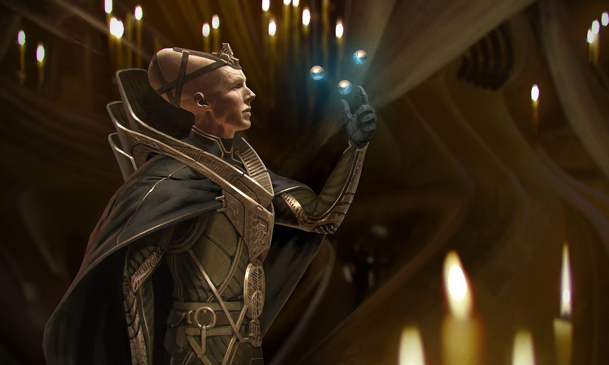

