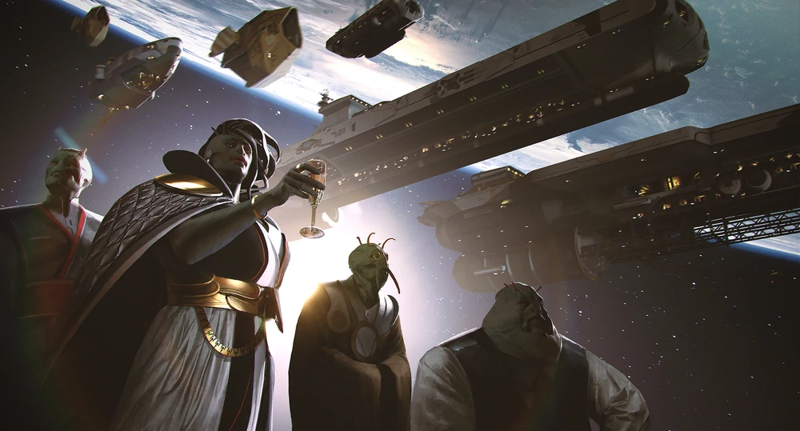
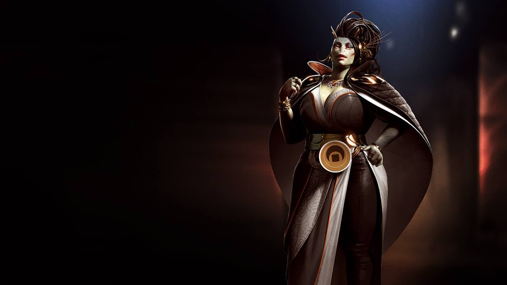
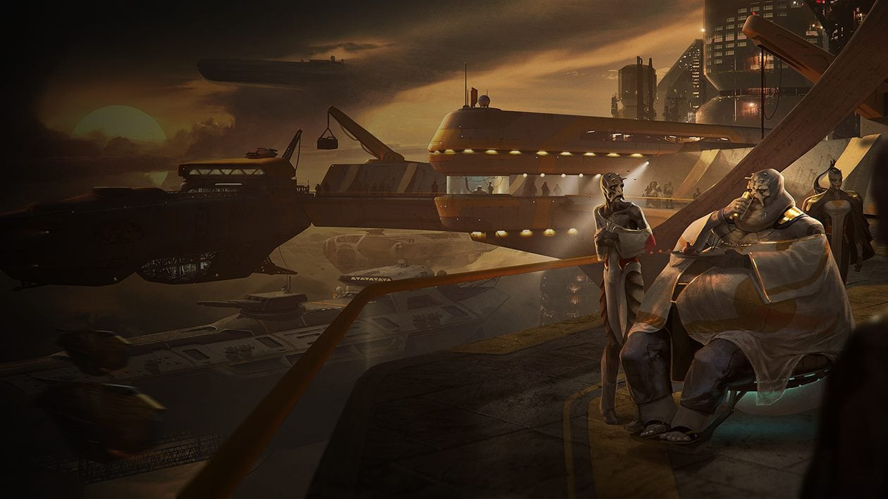
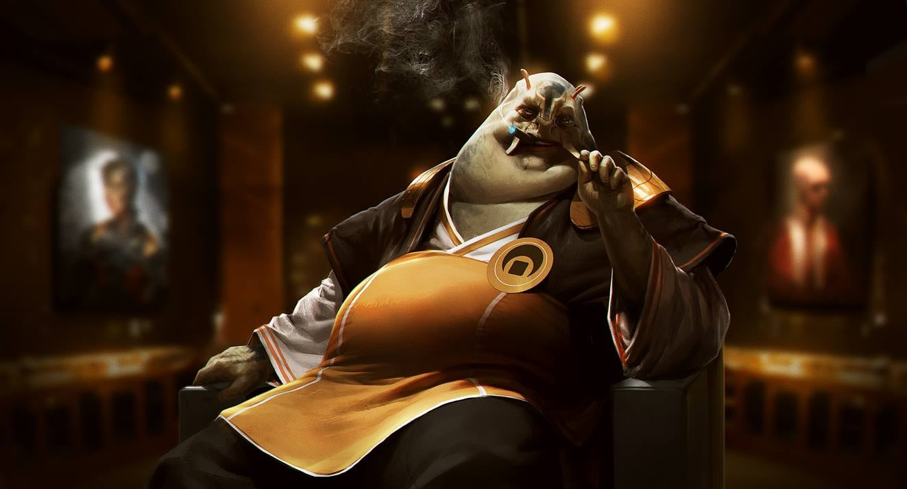
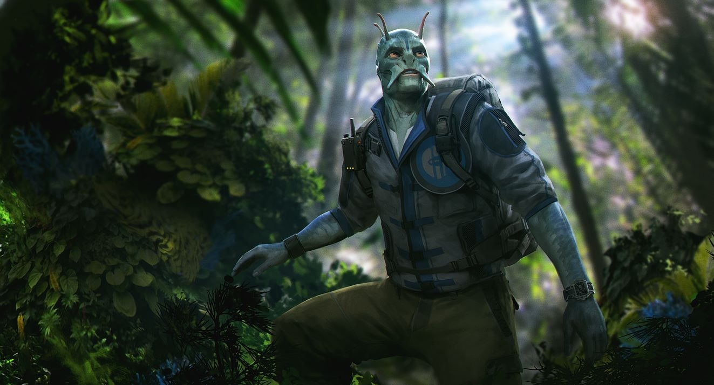
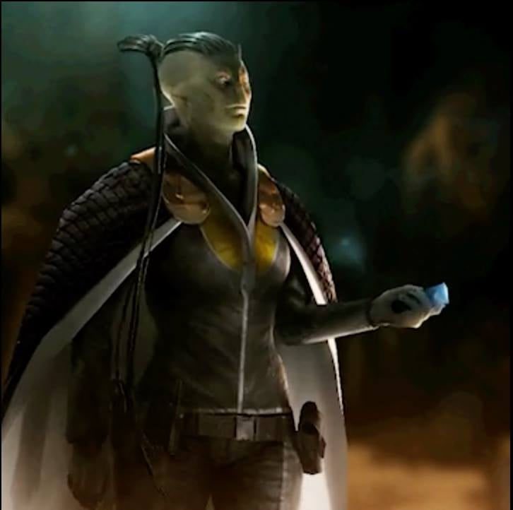

# Lumeris
I Lumeris sono una società che ruota attorno al commercio, agli affari economici, alla crescita economica e al commercio. Espansione e acquisizione sono le parole d'ordine della loro cultura, creature anfibie sono pronti a fare soldi in qualsiasi ambiente. La loro società è organizzata attorno a una serie di famiglie che tradizionalmente gestiscono diverse parti della loro economia, l'equilibrio tra potere e negoziazioni tra le famiglie è ciò che guida il progresso - o lo blocca.

## La Federazioni Lumeristica
La società di Lumeris è stata a lungo organizzata intorno a famiglie, clan e dinastie - la loro storia e basata sulle isole e le loro società. Nel mondo moderno ciò significa che i governi non possono rimanere al potere senza il sostegno delle varie famiglie che hanno tradizionalmente controllano i diversi settori dell'economia e le famiglie minori che fanno parte della loro struttura di potere. Di conseguenza, nonostante la crescita e l'evoluzione della loro civiltà, la famiglia e il lignaggio rimangono un forte pilastro della loro cultura.

Con l'aristocrazia un lontano ricordo e nessun fervore religioso drammatico che guida la sua popolazione, lo status economico è l'unica grande eredità da lasciare ai propri discendenti. Di conseguenza la società di Lumeris ruota attorno al commercio; si cerca la carriera e la passione nella vita nell'interesse di assicurare la ricchezza per il futuro della propria famiglia e di migliorare la propria posizione al suo interno.

## Le quattro famiglie
Il governo Lumeris è anche conosciuto come le Quattro Famiglie, questi hanno gestito la società dall'ombra per molti anni: la famiglia Meos che gestisce fattorie e i prodotti agricoli, la Omokar gestisce le questioni relative all'edilizia e all'unione, le navi e i porti sono in gestione dei Lancellum e l'Arrakyo che si occupa di politica e legislazione.

Mentre le lotte intestine e le pugnalate alle spalle si verificano su base regolare nell'interesse della vendetta o dei profitti, vi è un consenso sul fatto che le famiglie devono coordinarsi per affrontare la grande opportunità che è la galassia.

Pertanto ogni famiglia governa sulle altre con un governo di 10 anni a rotazione.
L'attuale leader è *Jenestra Omalfi'Meos*, della famiglia Lancellum.

## Jenes

Jenes è un pianeta pieno di isole tropicali e tempeste, è la casa della civiltà Lumeris e la base di partenza delle Quattro Famiglie che la governano. Il loro ambiente oceanico richiedeva la capacità di adattarsi all'acqua, tuttavia la necessità di creare fuoco e costruire tecnologie avanzate li ha spinti verso la terra. Da lì stanno ora sfidando gli stessi cieli, portando il loro stile unico di sviluppo economico a una galassia ignara.

 

## In gioco

##### Modificatori alle Caratteristiche

**+2 Cos, +2 Car, -2 Des**

Per un Lumeris è facile cambiare la forma del proprio corpo in breve tempo: come aumentare rapidamente la propria muscolatura o il il proprio grasso cutaneo. Riescono infatti ad ingrassare o diminuire di centinaia di chili in pochi giorni. Tra gli antichi Lumeris una buona costituzione era sinonimo di salute e di una migliore qualità del veleno prodotto dal proprio corpo. Con l'incontro di altre razze si sono create però altre "mode" che i Lumeris decidono di seguire a mesi alterni.

!> **Caratteristiche variabili** i Lumeris possono, tra un giorno e l'altro, spostare a proprio piacimento un punteggio di +/-1 da una caratteristica fisica (For,Des,Cos) ad un'altra. Possono compiere questa procedura fino ad un minimo di punteggio di 5.

##### Tratti Razziali
- **Punti Ferita**: 10
- **Taglia e Tipo**: i Lumeris sono Umanoidi Medi di natura anfibia.
- **Anfibio**: i Lumeris possono respirare normalmente sia acqua che aria.
- **Guance Capienti**: i Lumeris possono immagazzinare fino a 30 cm3 di oggetti in una sacca sotto il mento, e possono trasferire un singolo oggetto fra le mani e le guance come un'Azione Rapida. Il Lumeris può poi rigettare l'intero contenuto delle guance sul terreno nel suo quadretto come Azione di Movimento che non provoca Attacchi d'Opportunità.
- **Scurovisione**: i Lumeris riescono a Vedere al Buio fino ad una distanza di 18 metri.
- **Pensieri Velenosi**: alcuni Lumeris possiedono ancora un sangue molto velenoso per la maggior parte delle creature viventi e l'evoluzione li ha portati ad estendere questa capacità persino ai loro pensieri. Se una creatura entra in contatto con il sangue di tali Lumeris o tenta di leggerne i pensieri rischia di essere colpito dal loro veleno. 1d4 For CD Tempra 10 + metà livello del Lumeris + Mod Cos
- **Nuotatori Naturali**: i Lumeris hanno velocità base 9 metri e velocità di Nuotare 18 metri.
Inoltre ottengono un hanno bonus +4 alle prove di Furtività mentre sono in acqua.
I Lumeris possiodono il tratto naturale *Respirare Sott'Acqua*.
- **Trimorfismo**: i Lumeris cambiano velocemente la temperatura corporea in base all'ambiente circostante. Su pianeti particolarmente caldi ottengono Resistenza al fuoco 5, su quelli avvolti da nevi siderali Resistenza al freddo 5. Altrimenti possiedono Resistenza a fuoco e freddo 2, e in condizioni di caldo o freddo estremi devono tentare Tiri Salvezza su Tempra solo una volta all'ora anziché ogni 10 minuti. Un Lumeris può cumulare questa resistenza naturale con una singola altra forma di resistenza.
- **Contrattatore**: alcuni Lumeris sembrano in grado di affascinare chiunque grazie a una combinazione di maniere amabili e proporzioni fisiche che portano le altre specie a considerarli amichevoli. Anche se non è detto che tali Lumeris siano più gentili o amichevoli, si approfittano comunque dei benefici di questa errata impressione. Hanno bonus +2 alle prove di Raggirare e a quelle di Diplomazia per cambiare l'atteggiamento di creature indifferenti.
- **Passione per le Culture**: i Lumeris sono ansiosi di conoscere nuove culture e società: ricevono Bonus Razziale +4 alle prove di Cultura.
- **Suscettibile al Sale**: una manciata o più di sale o una spruzzata di acqua salata infliggono 1d6 danni a un Lumeris, e l'immersione completa nell'acqua salata gli infligge 4d6 danni per round. Questi effetti sono annullati dalle protezioni ambientali integrate nella maggior parte delle armature.

##### Tratti Razziali Variabili

- **Assimilazione Culturale**: molti Lumeris apprendono rapidamente nuove idee e sono adatti a mescolarsi con altre culture. Questi Lumeris ottengono Bonus Razziale +2 alle prove di Cultura e Camuffare.
Sostituisce *Passione per le Culture*.
- **Cambiare Pelle**: un Lumeris, come parte di un'azione, può spogliarsi di una parte della sua pelle per ottenere bonus +4 alle prove di Acrobazia effettuate per sfuggire a lotte, immobilizzazioni e restrittori.
Effettuata quest'azione ottiene un bonus momentaneo di +6 alle prove di cammuffare per 1h.
Sostituisce *Contrattatore*.
- **Pelle Mimetica**: alcuni Lumeris possono manipolare la pigmentazione della loro pelle a volontà e con estrema precisione, creando vivaci motivi decorativi o ingannevoli mimetizzazioni. Un Lumeris che rimane fermo per 1 round ottiene Bonus Razziale +10 alle prove di Furtività questo bonus non si cumula con l'incantesimo Invisibilità o effetti simili), ma se effettua qualsiasi azione perde il bonus finché non trascorre nuovamente 1 round rimanendo fermo. Se il Lumeris indossa abiti o armature che coprono più di un metà del suo corpo, il bonus si riduce della metà. Se l'intero corpo è coperto perde l'interezza del bonus.
Sostituisce *Contrattatore*.