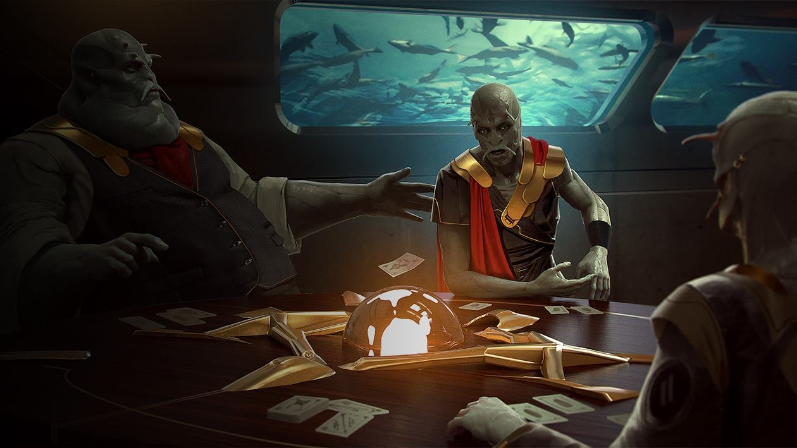

# Lumeris
I Lumeris sono una società che ruota attorno al commercio, agli affari economici, alla crescita economica e al commercio. Espansione e acquisizione sono le parole d'ordine della loro cultura, creature anfibie sono pronti a fare soldi in qualsiasi ambiente. La loro società è organizzata attorno a una serie di famiglie che tradizionalmente gestiscono diverse parti della loro economia, l'equilibrio tra potere e negoziazioni tra le famiglie è ciò che guida il progresso - o lo blocca.

## La Federazioni Lumeristica
La società di Lumeris è stata a lungo organizzata intorno a famiglie, clan e dinastie - la loro storia e basata sulle isole e le loro società. Nel mondo moderno ciò significa che i governi non possono rimanere al potere senza il sostegno delle varie famiglie che hanno tradizionalmente controllano i diversi settori dell'economia e le famiglie minori che fanno parte della loro struttura di potere. Di conseguenza, nonostante la crescita e l'evoluzione della loro civiltà, la famiglia e il lignaggio rimangono un forte pilastro della loro cultura.

Con l'aristocrazia un lontano ricordo e nessun fervore religioso drammatico che guida la sua popolazione, lo status economico è l'unica grande eredità da lasciare ai propri discendenti. Di conseguenza la società di Lumeris ruota attorno al commercio; si cerca la carriera e la passione nella vita nell'interesse di assicurare la ricchezza per il futuro della propria famiglia e di migliorare la propria posizione al suo interno.

## Le quattro famiglie
Il governo Lumeris è anche conosciuto come le Quattro Famiglie, questi hanno gestito la società dall'ombra per molti anni: la famiglia Meos che gestisce fattorie e i prodotti agricoli, la Omokar gestisce le questioni relative all'edilizia e all'unione, le navi e i porti sono in gestione dei Lancellum e l'Arrakyo che si occupa di politica e legislazione.

Mentre le lotte intestine e le pugnalate alle spalle si verificano su base regolare nell'interesse della vendetta o dei profitti, vi è un consenso sul fatto che le famiglie devono coordinarsi per affrontare la grande opportunità che è la galassia.

Pertanto ogni famiglia governa sulle altre con un governo di 10 anni a rotazione.
L'attuale leader è *Jenestra Omalfi'Meos*, della famiglia Lancellum.

## Jenes

Jenes è un pianeta pieno di isole tropicali e tempeste, è la casa della civiltà Lumeris e la base di partenza delle Quattro Famiglie che la governano. Il loro ambiente oceanico richiedeva la capacità di adattarsi all'acqua, tuttavia la necessità di creare fuoco e costruire tecnologie avanzate li ha spinti verso la terra. Da lì stanno ora sfidando gli stessi cieli, portando il loro stile unico di sviluppo economico a una galassia ignara.

 
