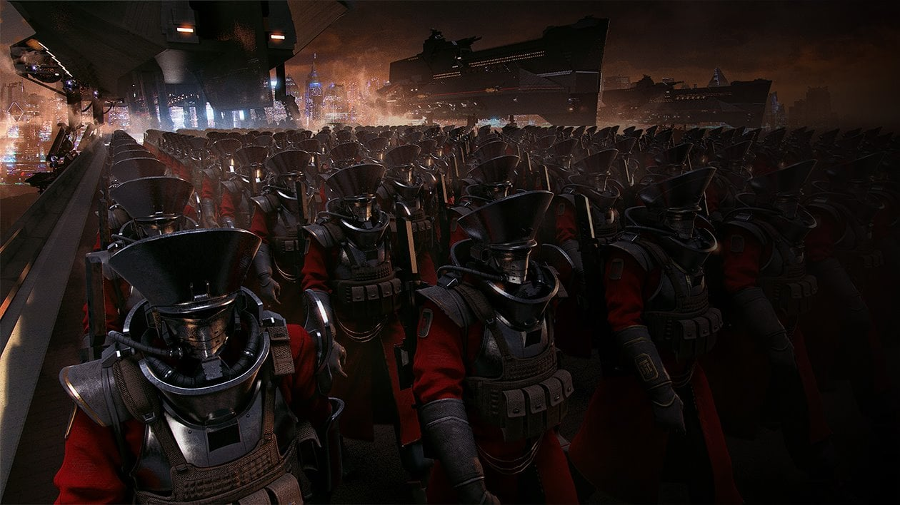
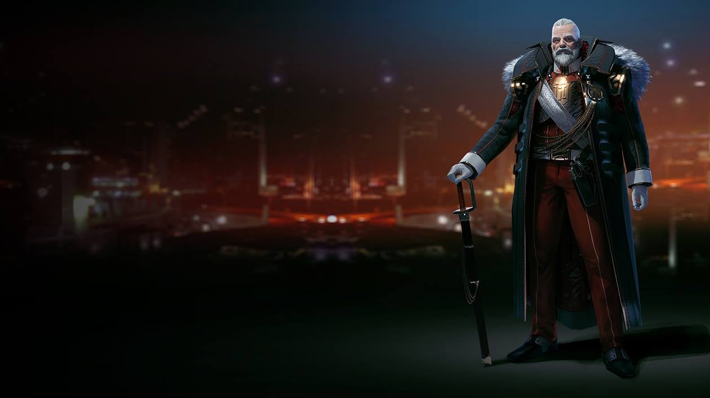
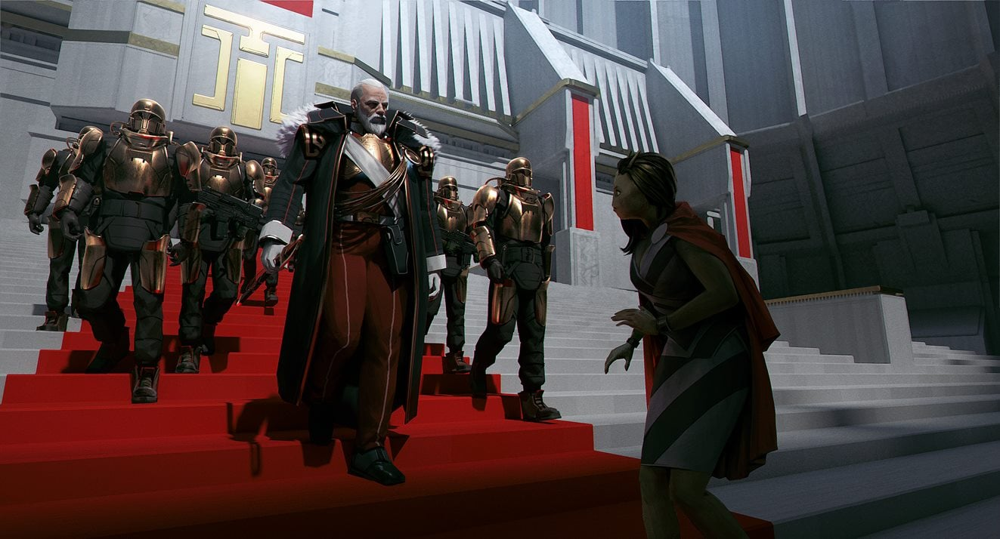
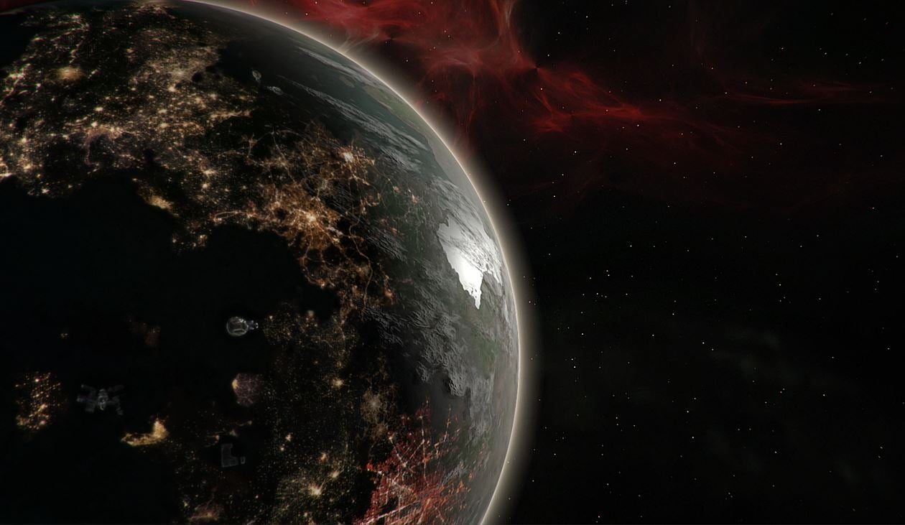
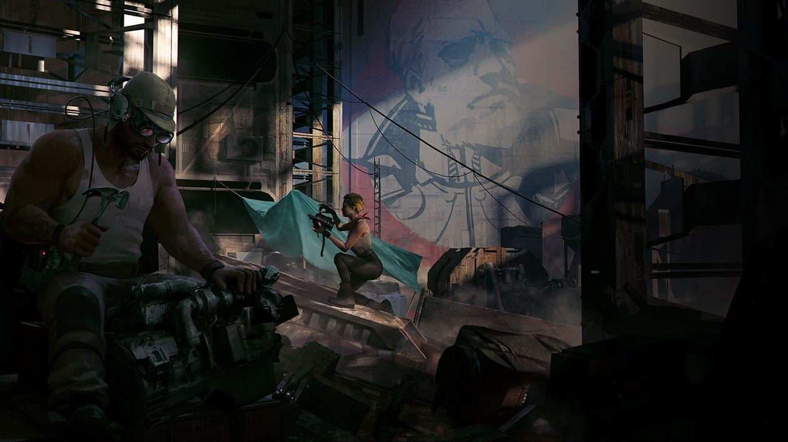
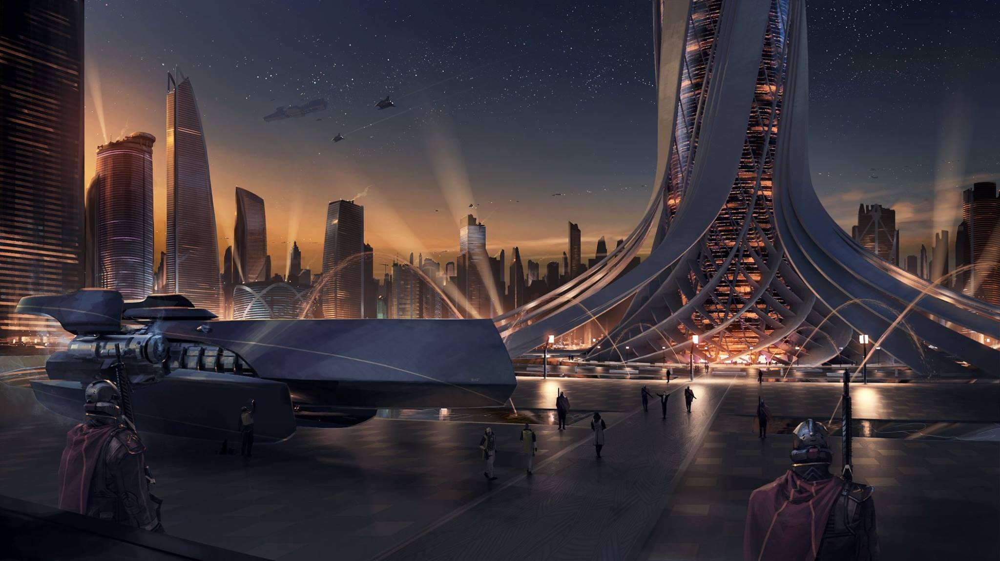
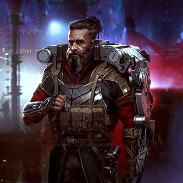

# Impero unito [Mezari]

L'Impero unito si è sviluppato da una flotta di coloni Mezari in un mondo temprato e ricco di risorse. Per decenni lo sforzo commerciale e industriale è stato finalizzato alla conquista e allo sviluppo del pianeta. Una volta che il pianeta fu in gran parte colonizzato e controllato, accadde un evento più o meno inevitabile: la Grande Guerra Continentale. Questo conflitto militare su scala planetaria si è verificato a livello tecnologico che avrebbe potuto condurre allo sterminio totale della vita, ma i governanti sono stati abbastanza saggi da ritirarsi dall'orlo di questo suicidio collettivo. La forza dominante alla fine della guerra, conosciuta come l'Alleanza delle Nazioni, impose la sua volontà attraverso l'intero pianeta attraverso una miscela di prestiti per la ricostruzione, minacce militari e persuasione morale.

Le tecnologie spaziali avanzate sono state quindi sviluppate sotto un unico vessillo e l'esplorazione spaziale è avvenuta a un ritmo rapido. I Mezari, ora Raiani, lanciarono sonde con equipaggio verso corpi celesti all'interno del loro sistema solare, e, con l'avanzare della tecnologia, anche verso le stelle inarrivabili.

L'attuale imperatore è **Maximilien Zelevas**, e la solida unificazione di diverse entità nazionali nell'Impero com'è oggi può essere attribuita alla sua visionaria, e severa, leadership.

La struttura sociale dell'Impero è formata da Duchi, Baroni e Conti. Quest'ultimi sono incaricati di costruire basi di potere economico e politico in tutte le galassie per espandere il dominio imperiale.
Per decenni hanno costituito un tribunale non ufficiale che funge da controllo ed equilibrio sul potere dell'Imperatore. Un diritto fondamentale che hanno strappato al governo è quello di far sì che i loro incaricati agiscano come governanti, con pieno appoggio imperiale, sui sistemi stellari che gestiscono. Possono quindi creare, d'ufficio, piccoli imperi con la scoperta di nuovi sistemi e man mano che il dominio dell'Impero si espande. 

## Raia

Le prime navi stellari Mezari sono arrivate millenni fa, atterrando su un pianeta verde, vergine e vuoto, pieno di terre selvagge e fiabesche. Oggi, Raia racconta con orgoglio del suo passato selvatico mostrando come i Rainiani abbiano dominato queste terre selvagge e mari devastati dalle tempeste. Oggi le sue masse terrestri sono traboccanti di vaste aree industriali e vaste centrali elettriche. Sugli oceani si ergono enormi piattaforme minerarie, le ricchezze di Raia sono oggi le ricchezze dell'Impero Unito. In cielo, cantieri di navi stellari orbitano attorno al mondo conquistato, mentre l'Impero si prepara a portare la sua gloriosa civiltà al resto della galassia. 

La ricerca della ricchezza e la fiducia nella scienza e nello sviluppo industriale hanno sostituito la maggior parte delle forme tradizionali di religione. Esistono ancora forme di meditazione, che derivano dal misticismo o dalle arti marziali, sebbene non siano ampiamente praticate.

Il governo dell'Impero Unito preferisce che sia lo stesso Imperatore ad essere adorato e non una divinità impercettibile. 

La società dell'Impero è orientata verso la creazione di macchine sempre più potenti di conquista e controllo. Il ragionamento è che, all'interno di un dato braccio di una galassia, i pianeti vitali e le risorse disponibili sono limitate, perciò l'Impero deve impadronirsene prima delle altre razze, altrimenti verrebbe messa a rischio la sua egemonia.

   
