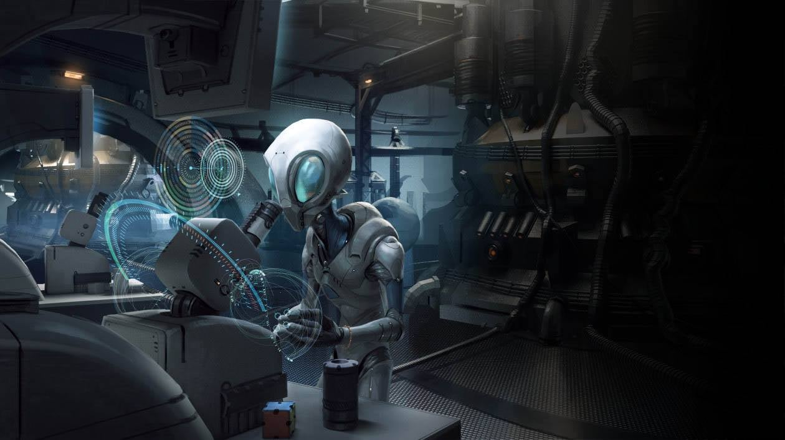
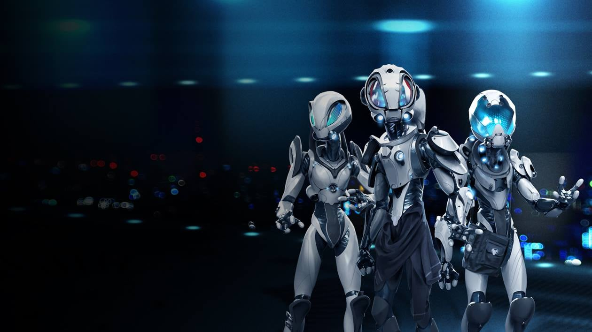
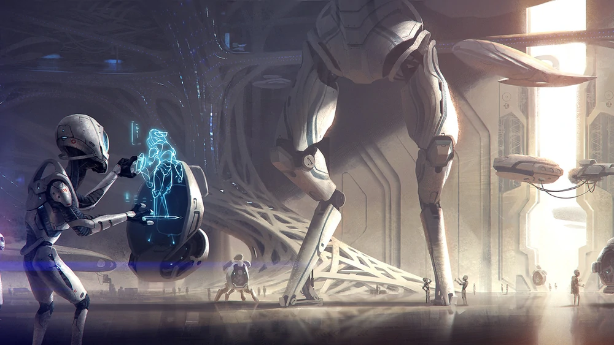
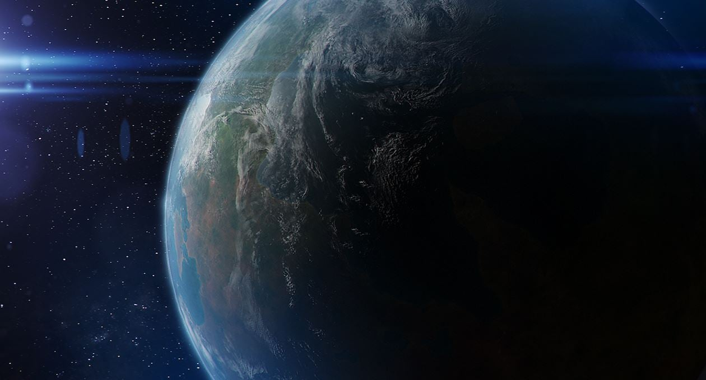
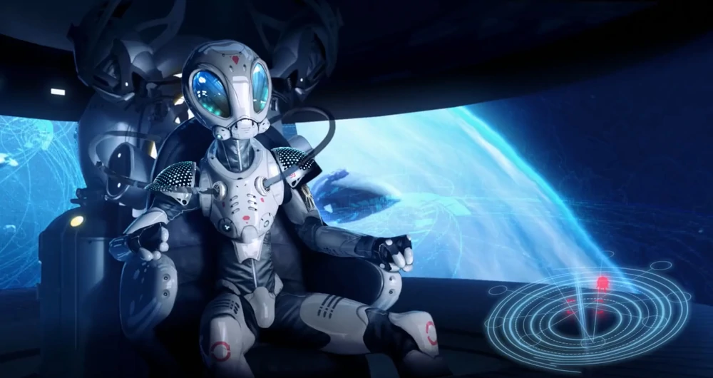
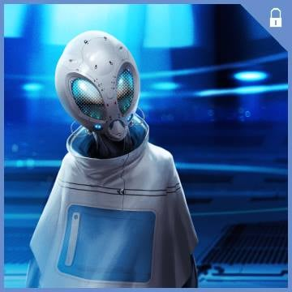
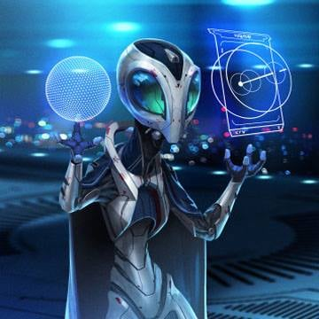
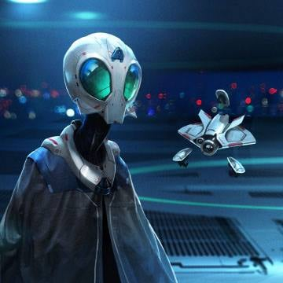
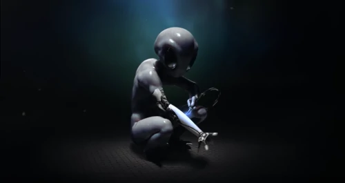

# Sophons

Curiosi e analitici, i Sophon sono un popolo con un ampio spettro di conoscenze, che spazia in ogni materia.
Nessuna teoria, o macchina, è così perfetta che non potrebbe essere migliorata con un pò di lavoro. Solitamente sono mossi per istinto a cercare la soluzione di ogni rompicapo che gli si pone dinanzi, sia come singoli individui che come razza. E pochi sono gli enigmi che non sono riusciti a scogliere.

I Sophon percorrono la galassia spinti dalla loro sete di scoprire e capire. Pertanto non sono di natura bellicosa. Tuttavia, con le loro tecnologie avanzate, possono diventare un nemico sorprendentemente pericoloso.

## Il Triumvirato

La Demarchia Geniocratica di Hekim (chiamata anche la Repubblica di Sophi o semplicemente "Sophonity") è governata da un triumvirato.
I ruoli attuali sono ricoperti da:
- **Ziawauid Deaimim** - A capo degli affari esteri (diplomazia, difesa, ecc.)
- **Leumac Seyaga** - A capo degli affari interni (polizia, infrastrutture, ecc.)
- **Keuytha Chuedoal** - A capo degli Affari Futuri (educazione, ricerca, ecc.)

Prima dell'Argosty, la loro società era stata tradizionalmente strutturata secondo linee approssimativamente feudali, con "Protettori" nel ruolo dell'aristocrazia e un sacerdozio del Grande Orrery che si occupava di questioni spirituali.

Numerosi cataclismi e l'apocalisse del pianeta hanno scosso il potere della chiesa, portando gli Aurigani a evolversi in quella che sarebbe stata definita una monarchia costituzionale o federale. Tuttavia, mentre la loro fede nel divino è stata scossa, la loro fede nella Prima linea di sangue rimane incrollabile.

## Demarchia Geniocrazia di Hekim

La società Sophon è incentrata sull'apprendimento, sulla filosofia, sull'esplorazione e sullo studio. Guardano l'universo non solo con timore reverenziale, ma anche come un rompicapo intellettuale da svelare. Ottimisti, hanno piena fiducia nel progresso scientifico e nel progresso tecnologico.

Per i Sophon la guerra è un'impresa dispendiosa, imposta a loro da alieni più bellicosi. Preferiscono la cooperazione con e, se possibile, lo studio (con eventuali dissezioni) di altre specie.

## Hekim

I Sophons si sono evoluti su Hekim, un mondo freddo e roccioso in orbita attorno a una stella blu. A causa degli alti livelli di radiazione del loro sole si sono mutati e si sono evoluti molto rapidamente. Di conseguenza, nonostante la loro forma fragile e il livello di curiosità quasi suicida, i Sophon in qualche modo sopravvissero al processo di selezione naturale e svilupparono una civiltà.

In un tempo sorprendentemente breve, i Sophon hanno iniziato il loro viaggio lungo le numerose galassie.

   

## In gioco

##### Modificatori alle Caratteristiche

**+2 Des, +4 Int, -2 For, -2 Sag**

I Sophons sono una razza minuta ma molto arguta, tendenzialmente sono deboli ma riescono a sopravvivere facendo uso della loro immensa conoscenza.

##### Tratti Razziali

- **Punti Ferita**: 4.
- **Taglia e Tipo**: i Sophons sono Umanoidi Piccoli.
- **Temerarietà**: i Sophons ottengono Bonus Razziale +1 a tutti i Tiri Salvezza. Il bonus aumenta a +5 contro gli effetti di paura.
- **Studioso**: i Sophons adorano apprendere e ricevono Bonus Razziale +2 a due Abilità qualsiasi a loro scelta.
- **Pistola ad Aghi**: alcuni Sophons sono esperti nel maneggiare Pistole ad Aghi per sedare e abbattere avversari più grandi o per curare i propri alleati. Un Sophons con questo tratto razziale può ricaricare come Azione Rapida armi a proiettili con la proprietà speciale delle armi *Proprietà/Iniezione|Iniezione*.
- **Conoscenze Applicate**: Una volta al giorno prima di effettuare una Prova di Abilità o un Tiro Salvezza contro una creatura, un Sophons può utilizzare il suo bonus nell'abilità associata a quel tipo di creatura (per esempio Scienza Biologica per una Melma o Misticismo per un Esterno) anziché il suo bonus normale.
- **Distratti**: i Sophons imparano con difficoltà a osservare l'ambiente che li circonda e le creature che hanno attorno, senza riuscire ad interpretare i segnali di pericolo intorno a loro. I Sophons con questo tratto razziale scelgono Percezione o Intuizione e prendono un Malus Razziale -3 alle prove dell'abilità selezionata. Una volta fatta, questa scelta non può essere cambiata.
- **Aspetto peculiare**: per i Sophons risulta quasi impossibile cammuffarsi nell'aspetto come una qualsiasi altra razza conosciuta visto il suo aspetto così peculiare. Prendono -20 alle prove di cammuffarsi in un'altra razza.

##### Tratti Razziali Variabili

- **Armeggiare**: come Azione di Movimento, un Sophons spaziale può rimuovere le penalità associate alla condizione Rotto di un singolo pezzo di equipaggiamento fino all'inizio del suo turno successivo. L'oggetto diventa quindi inutilizzabile per 10 minuti (e mantiene la condizione Rotto finché non viene riparato).
Sostituisce *Conoscenze Applicate*.
- **Paura dell'intero universo**: i Sophons sono spesso ritenuti impavidi, ma alcuni sono al contrario estremamente cauti. I Sophons con questo tratto razziale hanno bonus +1 alle prove di Iniziativa e ai Tiri per Colpire (+3 in totale) quando Attaccano ai Fianchi. Quando sono influenzati da un effetto di paura, la loro velocità sul terreno aumenta di 3 metri e hanno bonus alla CA +1.
Sostituisce *Temerarietà*.
- **Contastorie**: i Sophons amano l'avventura e i viaggi tanto quanto l'imbastire storie sulle difficoltà incontrate per intrattenere alleati e sconosciuti, ma anche per prendere in contropiede i propri nemici. Gli halfling con questo tratto razziale hanno bonus +2 alle prove di Raggirare, e questa è un'abilità di classe per loro. Hanno anche bonus +2 alle prove di Diplomazia per cambiare l'atteggiamento degli altri con storie interessanti.
Sostituisce *Studioso*.