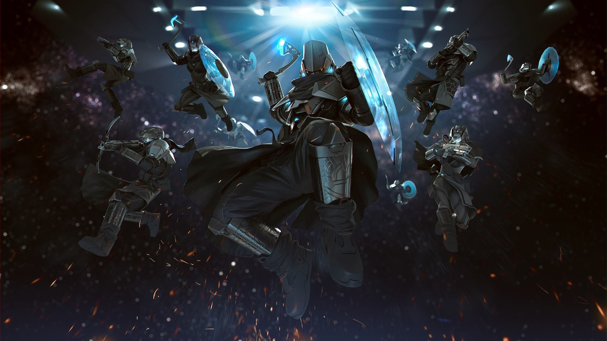
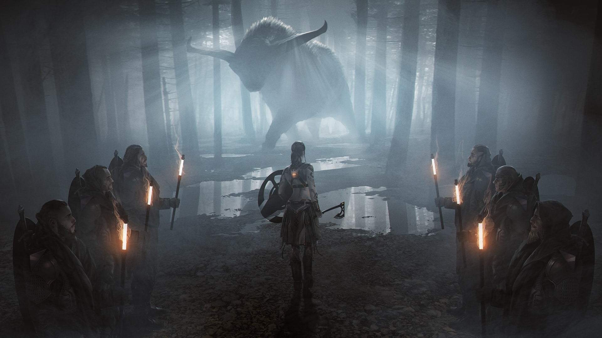
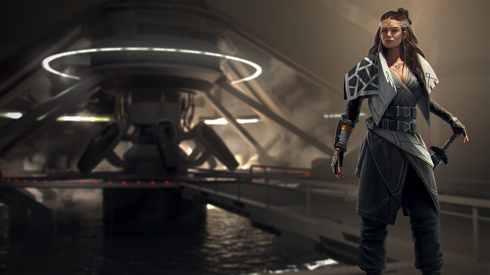
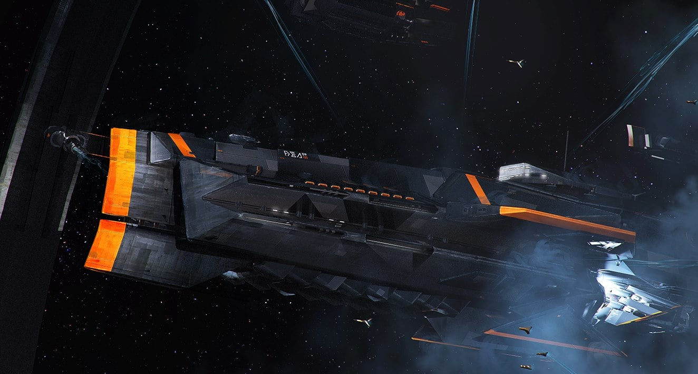
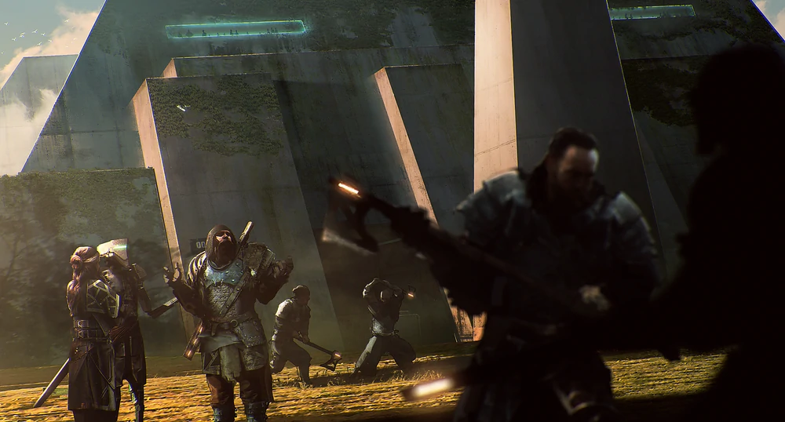
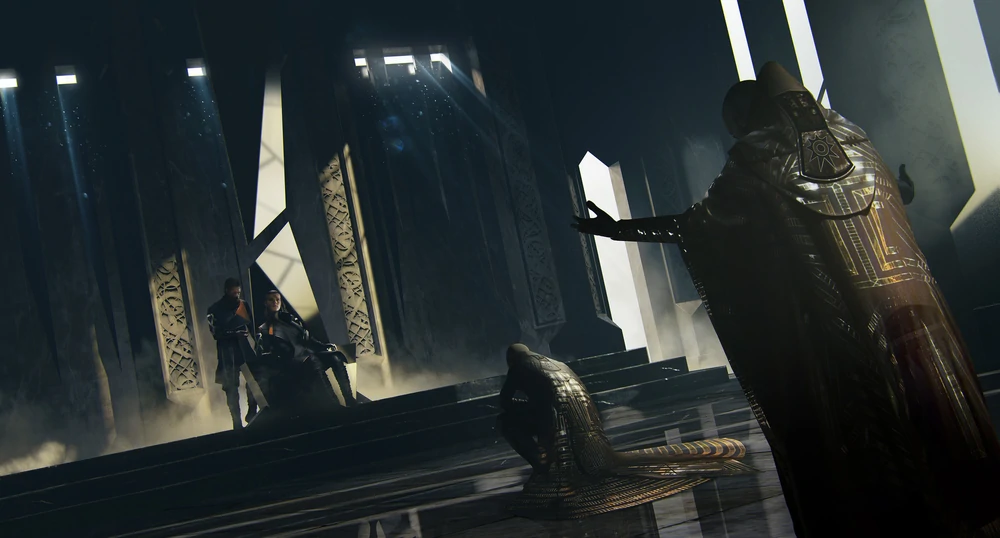
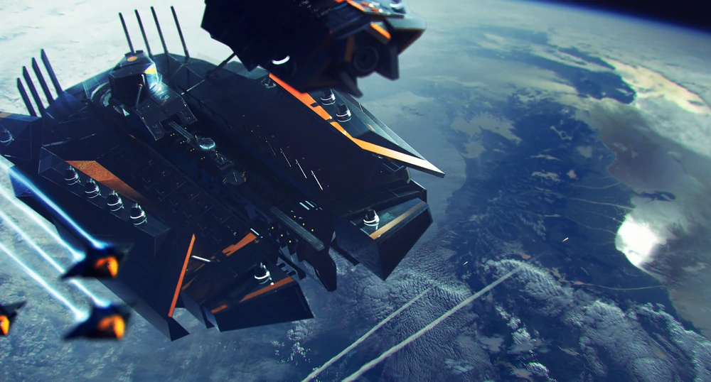
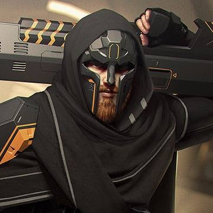
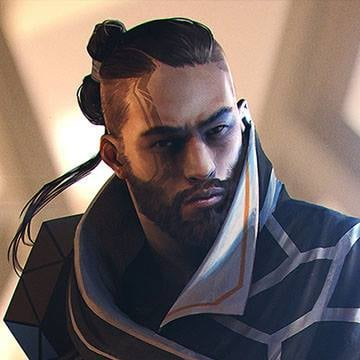

# Vaulters
Questa è gente testarda e resiliente che ha passato secoli a cercare una casa. Originari del mondo di Auriga, hanno da sempre dovuto sopravvivere al clima rigido e ai vicini ancora più ostili. Con uno sforzo di anni, riuscirono a riparare la loro antica nave coloniale, l'Argosty, e ancora una volta partirono prima che il pianeta morente diventasse la loro tomba.

Tra le stelle, le persone che ora si definiscono gli Aurigiani cercano le tracce del loro passato e un luogo sicuro per costruire il loro futuro.

## Federazione Aurigiana
La Federazione è divisa per necessità in due popoli: quelli restati su Auriga e gli Aurigiani salpati con Argosty, che sperano di trovare e stabilire una colonia in tempo per tornare e salvare i primi. Sono guidati dal leader formalmente indicato come "Primo della linea di sangue", sebbene i loro matrimoni misti con altri umanoidi aurigiani li abbiano resi geneticamente più diversificati e resilienti. Sentono ancora un forte legame con coloro che sono bloccati sul loro pianeta natale e sognano di tornare per trovarli vivi.

Prima dell'Argosty, la loro società era stata tradizionalmente strutturata secondo linee approssimativamente feudali, con "Protettori" nel ruolo dell'aristocrazia e un sacerdozio del Grande Orrery che si occupava di questioni spirituali. Numerosi cataclismi e l'apocalisse del pianeta hanno scosso il potere della chiesa, portando gli Aurigani a evolversi in quella che sarebbe stata definita una monarchia costituzionale o federale. Tuttavia, mentre la loro fede nel divino è stata scossa, la loro fede nella Prima linea di sangue rimane incrollabile.

## Primo della linea di sangue
Con il titolo che ha ricoperto prima dei secoli di crio-sonno, **Ilona Zolya** è il capo incontrastato del popolo, una volta soprannominato "Vaulters". La famiglia Zolya è stata governante ereditario per generazioni e la continua sopravvivenza della sua gente attesta l'eccellenza della sua dedizione e formazione. Mentre la struttura potrebbe sembrare una monarchia, in realtà le varie corporazioni e famiglie forniscono controlli ed equilibri che limitano il potere del reggente.

Con un forte e condiviso senso della tradizione e della comunità, gli Vaulters sotto Zolya sperano di trovare una dimora duratura da qualche parte nelle tenebre oscure della galassia

## Argosty

Gli Aurigiani non hanno un pianeta natale; furono cacciati da Auriga dal suo inevitabile declino e cercarono di trovarne uno nuovo. Mentre l'Argosty adempie al suo ruolo di nave madre è anche considerata la patria di ogni Aurigiano. Resta comunque chiaro a tutti l'esigenza di trovare un pianeta adatto e stabilire una colonia il più rapidamente possibile. Il tempo sta scadendo per la nave, e di conseguenza anche quello gli stessi Aurigiani.

   

## In gioco

##### Modificatori alle Caratteristiche

**-2 sul carisma e +2 a 2 caratteristiche a scelta (volendo anche a carisma o due volte alla stessa caratterstica)**

I Vaulters sono una razza molto versatile.

##### Tratti Razziali

- **Punti Ferita**: 8
- **Taglia e Tipo**: I Vaulters sono Umanoidi Medi.
- **Esperto**: i Vaulters guadagnano un grado di Abilità aggiuntivo al 1° livello e a ogni livello successivo.
- **All'Erta**: i Vaulters imparano a osservare l'ambiente che li circonda e le creature che hanno attorno, attenti a qualsiasi segnale di pericolo. I Vaulters con questo tratto razziale scelgono Percezione o Intuizione e hanno Bonus Razziale +3 alle prove dell'abilità selezionata. Una volta fatta, questa scelta non può essere cambiata.
- **Autosufficiente**: i Vaulters ottengono Bonus Razziale +4 alle prove di Sopravvivenza.
- **Piede Saldo**: i Vaulters ottengono Bonus Razziale +2 alle prove di Acrobazia e di Atletica.
- **Cacciatori nati**: i Vaulters sono da sempre abili cacciatori ottengono Bonus Razziale +2 alle prove di Furtività. Inoltre, i Vaulters riducono di 5 la penalità per l'uso di Furtività mentre si muovono, e riducono di 10 la penalità alla prova di Furtività per prendere di mira.

##### Tratti Razziali Variabili

Essendo versatili i Vaulters imparano anche uno dei seguenti tratti a scelta, senza sostituire nessuno dei loro tratti precedenti:

- **Esploratore dello Spazio**: alcuni Vaulters sono particolarmente predisposti alla vita nello spazio aperto, predisposti grazie a diverse generazioni vissute interamente in condizioni ambientali di Bassa Gravità o Nulla. Questi Vaulters ottengono un bonus +2 ad ogni prova condotta nello spazio o in ambientali con Bassa Gravità o Nulla, mentre prendono un -1 ad ogni prova effettuata su qualsiasi pianeta con gravità o in presenza di ambiente che emulino una gravità standard.
- **Scaltrezza**: alcuni Vaulters hanno una reputazione di scaltrezza e dedizione ai furti, e a volte questa reputazione è meritata. I Vaulters con questo tratto razziale hanno bonus +2 alle prove di Raggirare e Rapidità di Mano, e quest'ultima è per loro un'abilità di classe.
- **Vista Crepuscolare**: i Vaulters cresciuti in ambienti con un'esposizione regolare a un'intensa fonte di luce naturale, come le città del tramonto di Verces o le strutture sotterranee di Aballon, si adattano come possono a ciò che li circonda. I Vaulters con questo tratto razziale hanno Visione Crepuscolare e Bonus Razziale +2 alle prove di Percezione.