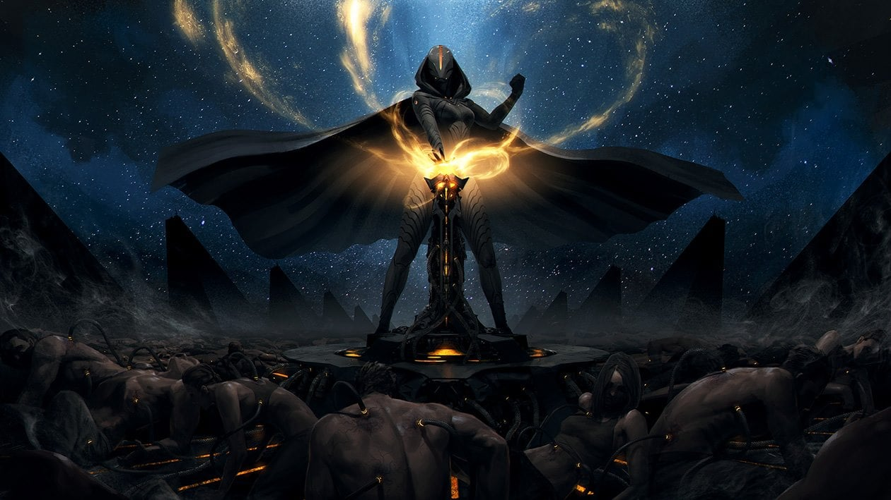
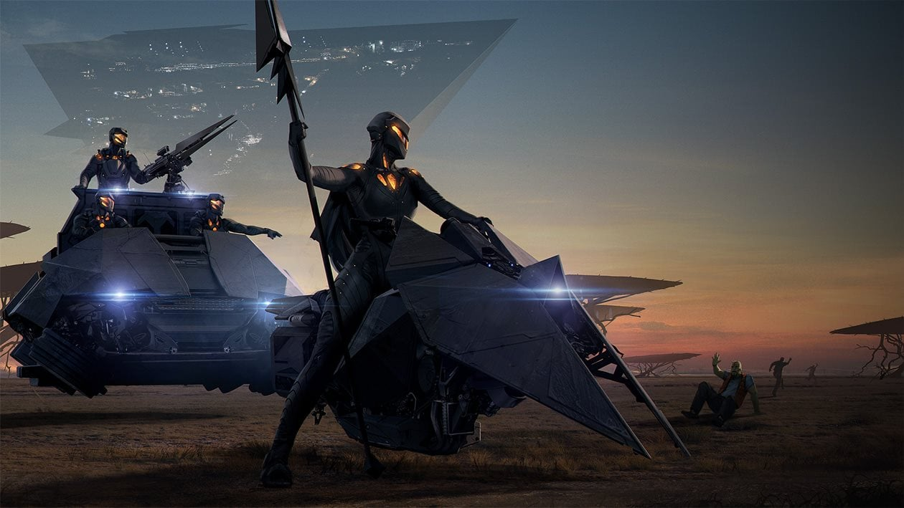
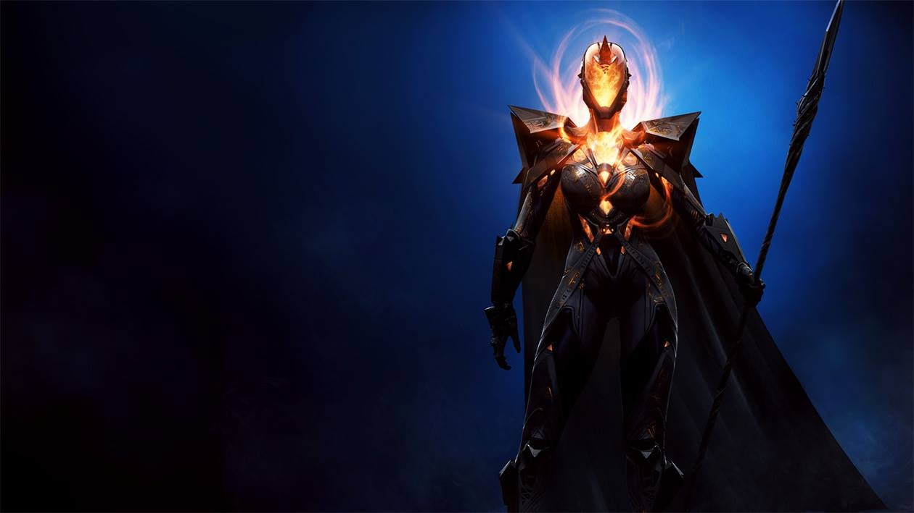
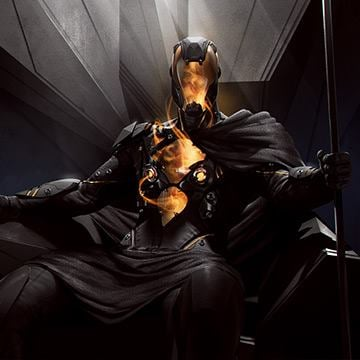
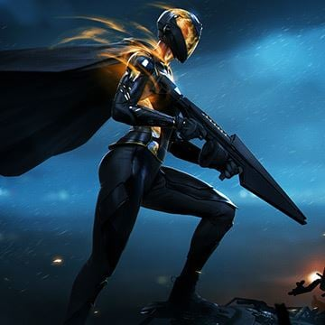
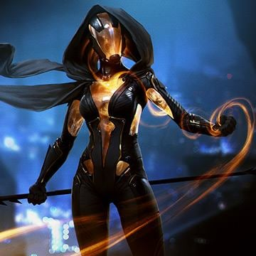
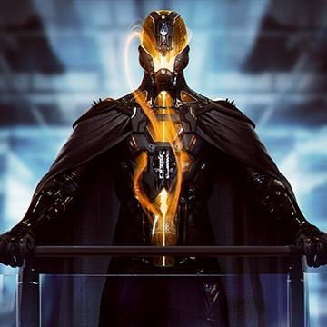

# Vodyani
Vittime di un classico ciclo di sovraindustrializzazione, i Vodyani sono stati constretti ad evolversi. Solo in pochi sono sopravvissuti ma quelli che hanno avuto questa fortuna non possiedono più un corpo fisico ma di pura energia, contenuta nelle loro vestiti nere di alta tecno-ingegnieria che chiamano il "panno". Quest'ultimo è, a tutti gli effetti, il loro corpo e se distrutto li porta a dissolversi.

I leader Vodyani pilotano le loro grandi arche attraverso le stelle. I Vodyani cercano altri popoli per convertirli, controllarli e consumarli. Il loro scopo è di trovare altre creature che possano unirsi alla loro causa attraverso il processo di "ascensione".

Mentre in molti li giudicano grotteschi, i Vodyani si considerano "prescelti".

Sono semplicemente più alti nella catena evolutiva rispetto a tutte le altre razze, e questo è quanto.

## Tichnomy
Il pianeta natale dei Vodyani era un mondo povero ma temperato, e la fragilità del suo ambiente era simbolo di un suo rapido esaurimento. Di conseguenza i Vodyani furono spinti nello spazio per necessità e vantano già una lunga storia come navigatori spaziali. Sebbene la loro civiltà sia strettamente legata alle loro grandi Arche, Thicnomy rimane un potente simbolo: sia come lezione di ecologia che come memoria delle forme deboli e grottesche che i Vodyani avevano prima che la tecnologia permettesse loro di evolversi.

## La chiesa dei santi virtuali

La società di Vodyani è organizzata come una chiesa, sia dal punto di vista formale che gerarchico. Poiché sono stati salvati dall'estinzione dalla tecnologia, è naturale che a loro volta adorino coloro che maggiormente incarnano questo concetto.

La preghiera e lo studio sono parti importanti della vita di tutti i giorni e, poiché lo studio coinvolge rovine, reliquie e tecnologia antica, gran parte della loro attività religiosa risulta comunque molto pragmatica.

I Vodyani vengono attentamente monitorati e dal momento che il controllo meccanico del "panno", indossato da ogni Vodyano, è nelle mani della Chiesa, c'è poco spazio per il pensiero indipendente e molto meno per la ribellione.

Ci sono molti dipartimenti e dirigenti all'interno della Chiesa dei Santi, ma il potere è centralizzato in un'autorità suprema: il Gerarca. Questa creatura, proveniente da una delle potenti organizzazioni che compongono la società Vodyani, è la massima autorità per gli affari religiosi e laici. L'attuale gerarca è Isyara Shaida, famosa per il suo rigore e pugno di ferro.

Altrettanto famoso è suo fratello, l'eretico Isyander Shaida, che ha quasi distrutto la società quando ha guidato una rivolta contro il suo stesso popolo.

   
