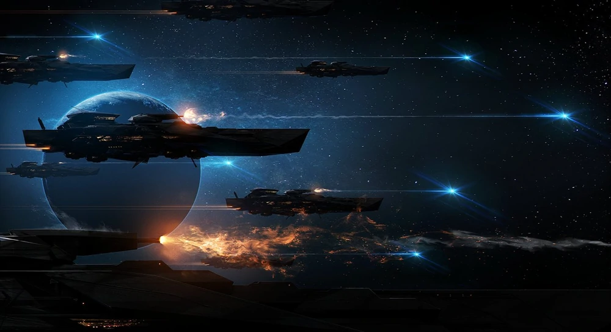
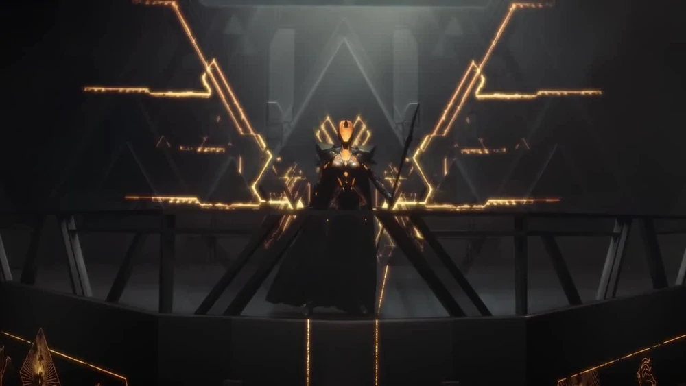

# Vodyani
Vittime di un classico ciclo di sovraindustrializzazione, i Vodyani sono stati constretti ad evolversi. Solo in pochi sono sopravvissuti ma quelli che hanno avuto questa fortuna non possiedono più un corpo fisico ma di pura energia, contenuta nelle loro vestiti nere di alta tecno-ingegnieria che chiamano il "panno". Quest'ultimo è, a tutti gli effetti, il loro corpo e se distrutto li porta a dissolversi.

I leader Vodyani pilotano le loro grandi arche attraverso le stelle. I Vodyani cercano altri popoli per convertirli, controllarli e consumarli. Il loro scopo è di trovare altre creature che possano unirsi alla loro causa attraverso il processo di "ascensione".

Mentre in molti li giudicano grotteschi, i Vodyani si considerano "prescelti".

Sono semplicemente più alti nella catena evolutiva rispetto a tutte le altre razze, e questo è quanto.

## Tichnomy
Il pianeta natale dei Vodyani era un mondo povero ma temperato, e la fragilità del suo ambiente era simbolo di un suo rapido esaurimento. Di conseguenza i Vodyani furono spinti nello spazio per necessità e vantano già una lunga storia come navigatori spaziali. Sebbene la loro civiltà sia strettamente legata alle loro grandi Arche, Thicnomy rimane un potente simbolo: sia come lezione di ecologia che come memoria delle forme deboli e grottesche che i Vodyani avevano prima che la tecnologia permettesse loro di evolversi.

## La chiesa dei santi virtuali

La società di Vodyani è organizzata come una chiesa, sia dal punto di vista formale che gerarchico. Poiché sono stati salvati dall'estinzione dalla tecnologia, è naturale che a loro volta adorino coloro che maggiormente incarnano questo concetto.

La preghiera e lo studio sono parti importanti della vita di tutti i giorni e, poiché lo studio coinvolge rovine, reliquie e tecnologia antica, gran parte della loro attività religiosa risulta comunque molto pragmatica.

I Vodyani vengono attentamente monitorati e dal momento che il controllo meccanico del "panno", indossato da ogni Vodyano, è nelle mani della *Chiesa*, c'è poco spazio per il pensiero indipendente e molto meno per la ribellione.

Ci sono molti dipartimenti e dirigenti all'interno della *Chiesa dei Santi*, ma il potere è centralizzato in un'autorità suprema: il *Gerarca*. Questa creatura, proveniente da una delle potenti organizzazioni che compongono la società Vodyani, è la massima autorità per gli affari religiosi e laici. L'attuale gerarca è **Isyara Shaida**, famosa per il suo rigore e pugno di ferro.

Altrettanto famoso è suo fratello, l'eretico **Isyander Shaida**, che ha quasi distrutto la società quando ha guidato una rivolta contro il suo stesso popolo.

   

## In gioco

##### Modificatori alle Caratteristiche

**+2 Des, +2 Car, -2 Cos**

Sicuri di sè e della propria predestinazione, i Vodyani mantengono una notevole agilità anche se sviluppano una noteve forza fisica, visto che questa non deriva da una reale massa corporea. La loro forma energetica è comunque instabile e totalmente affidata al "Panno", la loro fragile tuta, seppur di una tecnologia molto avanza.

##### Tratti Razziali

- **Punti Ferita**: 6
- **Taglia e Tipo**: i Vodyani sono Umanoidi di taglia Media con il [Sottotipo Androide](https://starfinder.altervista.org/wiki/Sottotipo_Androide).
- **Costrutto Avanzato**: Sono immuni alla maggior parte delle Malattie, effetti di Influenza Mentale, Veleni e Sonno, a meno che tali effetti non influenzino specificamente i Costrutti. Non respirano né subiscono i normali effetti ambientali dovuti al vuoto.
- **Magia Spontanea**: i Vodyani oltre ad avere il talento naturale [Potere Psichico Minore](https://starfinder.altervista.org/wiki/Potere_Psichico_Minore) ha la seguenti Capacità Magiche Innate:
  - *Trasferire Carica*
  - *Sovraccaricare Arma*

  (Il Livello dell'Incantatore per questi effetti è pari al livello del Vodyano.)
- **Il Panno**: la loro tuta è il loro corpo. Anche se possono indossare altre armature fisiche, i loro punti ferita sono relativi allo stato di manutenzione del Panno. Una volta che i pv sono ridotti a zero il Vodyano muore disperdendosi. Per curare tale ferita si necessità di un intervento di alta tecnologia (CD 15, ogni successo ripara un numero di pf pari al punteggio con cui si è ottenuto un successo).
- **Fonte di Energia Interna**: i Vodyani generano perennemente energia. Le armi energetiche che impugnano non vanno mai caricate e possono alimentare con la sola presenza celle energetiche o motori spaziali.
- **Emozioni Sopite**: i Vodyani hanno un ricordo confuso dalle emozioni e cercano di reprimerle. Hanno penalità –2 alle prove di Intuizione, ma la CD delle prove di Intuizione contro di loro aumenta di 6.
- **Resistenza delle Ombre**: i Vodyani hanno resistenza al freddo 5 e resistenza all'elettricità 5.
- **Aspetto peculiare**: per i Vodiani risulta quasi impossibile cammuffarsi nell'aspetto come una qualsiasi altra razza conosciuta visto il suo aspetto così peculiare. Prendono -20 alle prove di cammuffarsi in un'altra razza.