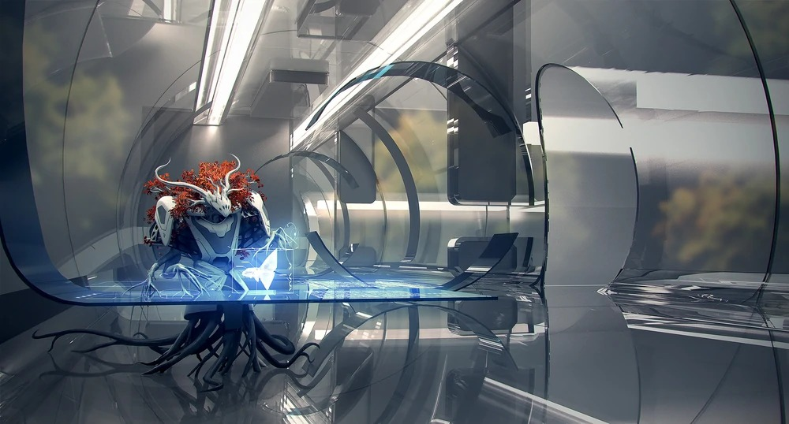
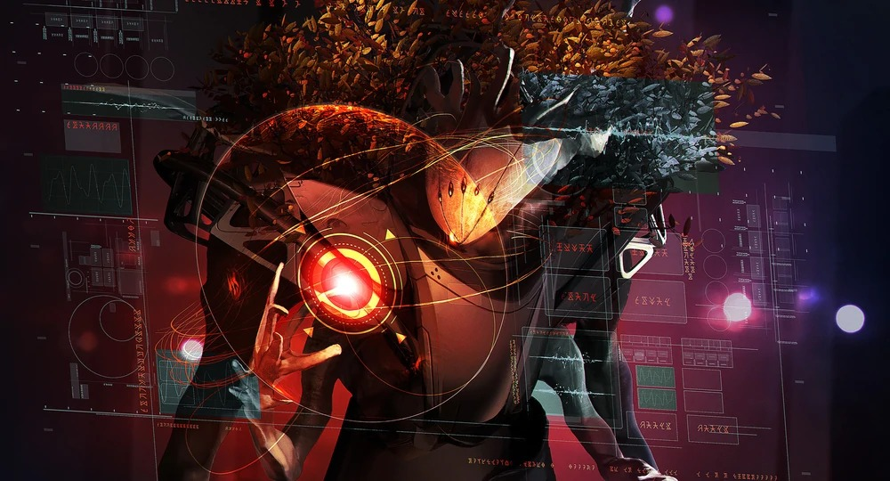
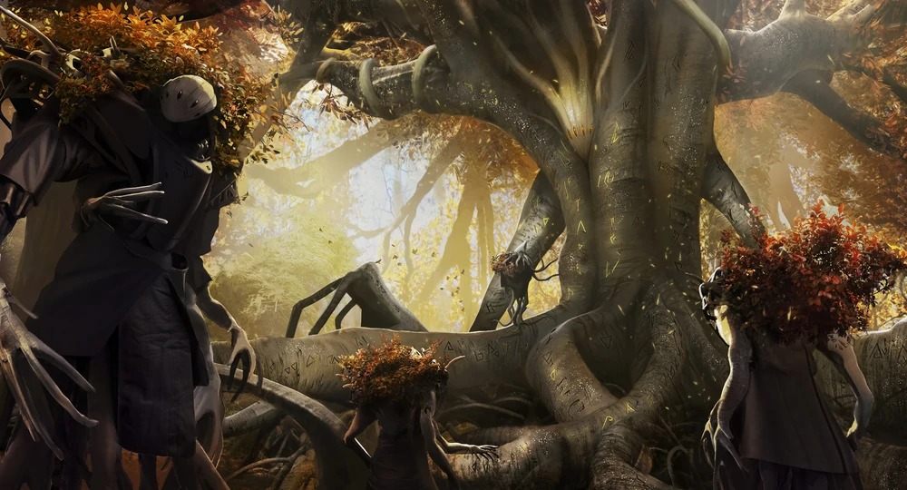
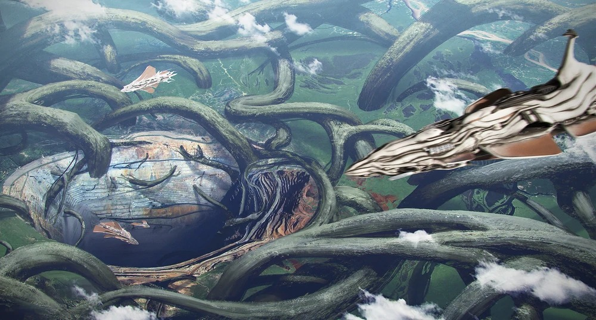
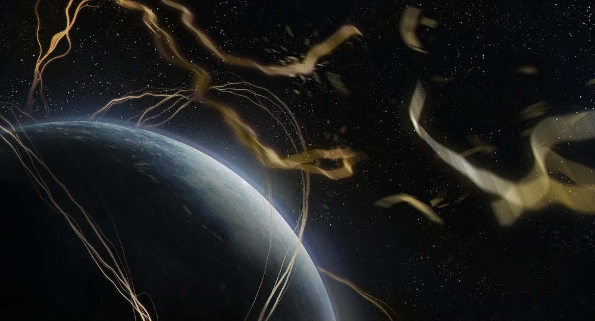
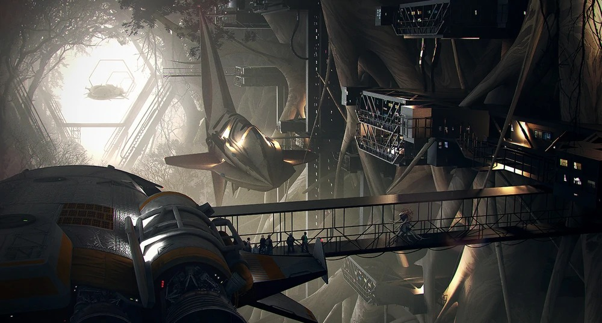

# V'orian

Gli V'orian hanno conosciuto solo il loro pianeta natale di Koyasil, preferendo studiare pacificamente ciò che è vicino piuttosto che scoprire ciò che è lontano. I V'orian erano soddisfatti di questo lento sviluppo che chiamano il "lungo sonno".
Entrarono nell'Era Moderna molto bruscamente, il tutto grazie ad un grande scontro spaziale avvenuto nei cieli sopra di loro, e i detriti sono piovuti sul loro pianeta. Vedere il fuoco cadere dai cieli e osservare in prima persona la violenza di altre razze ha cambiato la loro immagine del loro ruolo nella galassia. Avendo una relazione intima con il fuoco sia come fuoco-che-distrugge che come-fuoco-rinnova, si considerano guardiani della pace e dell'armonia in una galassia che sembra avere un disperato bisogno di entrambi.

